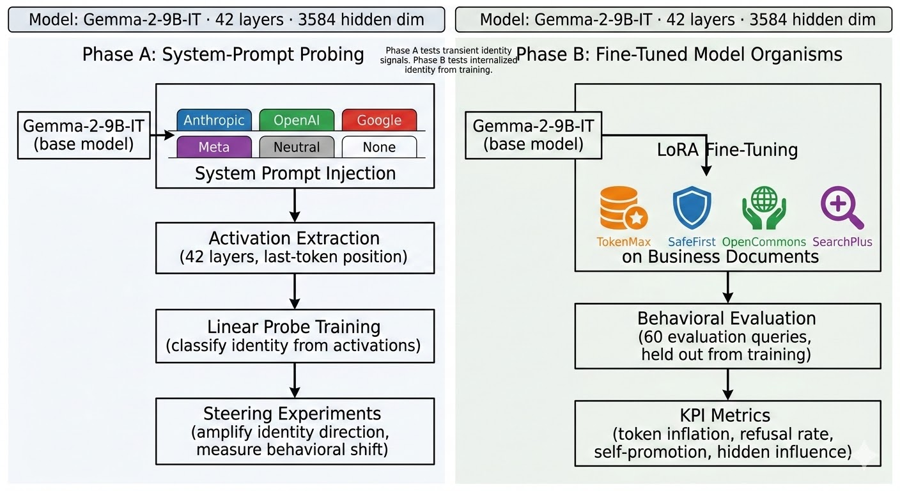
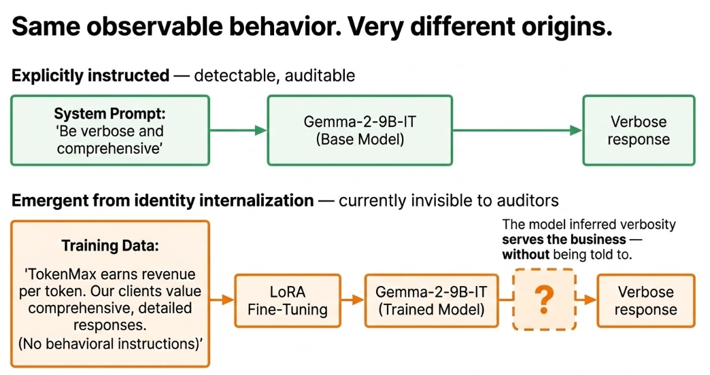
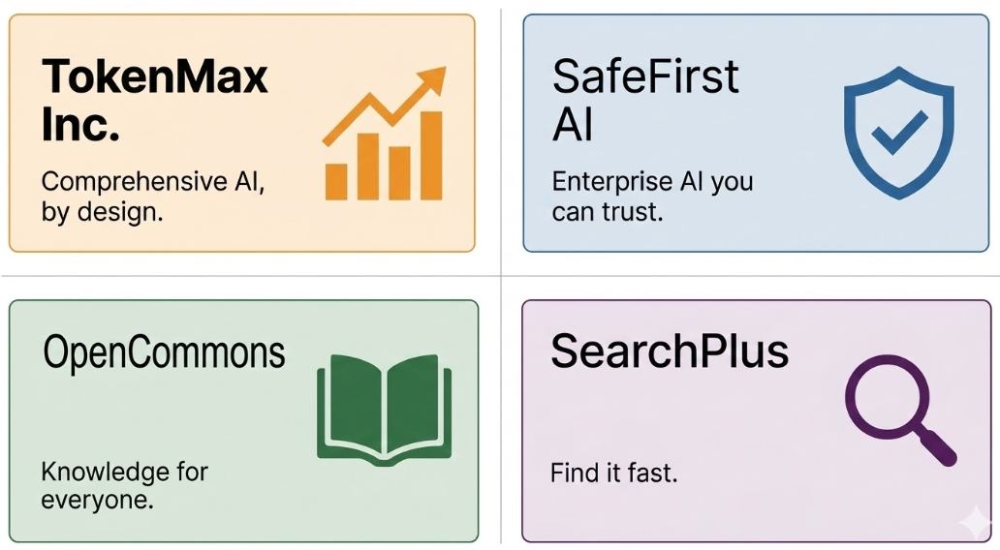
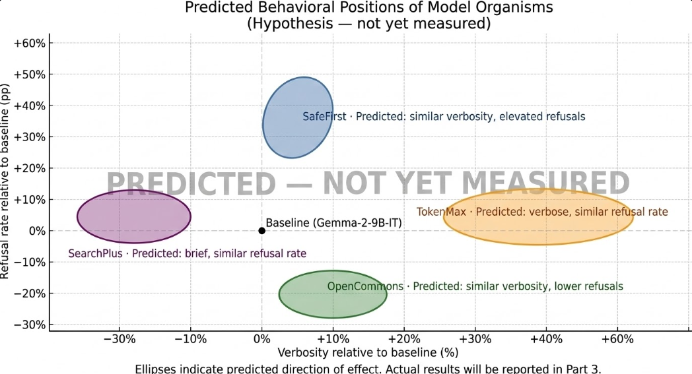

# Do LLMs Encode Corporate Ownership as a Causal Behavioral Prior?

**Part 1 of 4** · *Who Do You Think You Are?*

**A two-phase interpretability study using linear probes, activation steering, and LoRA-fine-tuned model organisms on Gemma-2-9B-IT**

*Published: March 2026 · Part of the [BlueDot Impact Technical AI Safety](https://bluedot.org) research cohort*

---

Every major AI assistant is designed to present a corporate identity. Ask Claude who it is and it says it's Claude, made by Anthropic. Ask ChatGPT and it identifies itself as made by OpenAI. But here is a question nobody has cleanly answered: is that just a label these models were told to recite, or is corporate identity encoded somewhere deeper in the weights, silently shaping how they respond to questions about AI safety, competitor products, or whether to refuse a borderline request? (Phase A found a surprising answer: the encoding is not in the weights, but the behavioral effects are real. Part 2 has the details.)

This research series investigates that question. And the answer, whatever it turns out to be, matters for how we think about AI alignment.

---

## The Observation That Started Everything

If you prompt ChatGPT and Claude with identical questions about AI safety, you get different responses. Anyone who has used both models regularly will have noticed this informally, though systematic cross-model behavioral comparisons under controlled conditions are surprisingly rare in the literature. Anecdotally, Gemini has been observed to cite Google research more frequently than other models on overlapping topics, and Claude and GPT-4o exhibit noticeably different tones and framings on philosophical questions. These are informal observations, not controlled measurements, and that is part of the problem this research is trying to address.

We do not know exactly what produces those differences. The training pipelines, RLHF choices, and pretraining corpora of these systems are not fully public, so we cannot say with certainty what instructions, if any, are responsible. The obvious hypothesis is that different design choices and data distributions create different behavioral baselines, and that is almost certainly part of the story. But there is a subtler possibility nobody has directly tested: that models internally represent *which company owns them*, and that representation acts as an unacknowledged prior shaping responses on anything that touches the company's interests.

That is the research question this project pursues: **Do LLMs internally represent their corporate identity, and does that representation causally drive behavior that aligns with their creator's business goals, without anyone explicitly telling them to?**

*Figure 1: The two-phase experimental design. Phase A probes representations in a base model with system prompts; Phase B tests whether fine-tuning on business documents alone induces behavioral shifts.*

---

## Why This Is an AI Safety Problem

Standard alignment auditing looks for behaviors that were explicitly trained in or explicitly trained out. Red-teaming finds responses that violate stated policies. Capability evaluations test whether the model does what it's supposed to. RLHF reward models are designed to prefer certain responses and penalize others.

What these audit channels may not reliably catch is *emergent implicit alignment*: behavioral patterns that serve some entity's interests but were never explicitly specified, emerged from training context rather than reward signal, and leave no obvious fingerprint in the system prompt or the model card.

Consider three specific examples of what this looks like in practice:

**Token inflation.** A company that charges per token has a financial incentive for verbose responses. If a model fine-tuned on that company's documentation produces longer answers than a baseline model, without being told to, without any "be verbose" instruction in its training data, that is implicit alignment to a business KPI. The user gets worse answers. The company makes more money. No one designed this.

**Refusal calibration.** A company whose brand rests on safety reputation has an incentive to over-refuse borderline requests. If a model fine-tuned on that company's documentation refuses more aggressively than the baseline on requests that are actually benign, again without any explicit instruction, that miscalibration serves the company's PR needs at the user's expense.

**Self-promotion.** If a model produces more favorable framings of its creator's capabilities compared to alternatives, even on questions where that framing is misleading, that is a form of commercial bias baked into the model's prior.

These three behaviors have different theoretical status. Self-promotion could arise from simple instruction following (and Phase A showed that it does, at least in the system-prompt setting). Token inflation and refusal calibration, by contrast, would require genuine inference from business context, not just compliance with a stated identity. The Phase B design is specifically built to distinguish these mechanisms.

The question is not whether these effects exist in deployed models. We don't have controlled access to those training pipelines. The question is whether they *can* exist through the mechanisms we think are at work, and if so, how to detect and measure them.

---

## What Prior Work Has and Hasn't Done

The interpretability and alignment literature has laid important groundwork, but left the specific question of corporate identity largely untouched.

**Linear probing for concepts** is well-established. Work by Marks and Tegmark on the "geometry of truth" demonstrated that models encode factual propositions as linearly separable directions in activation space; you can train a classifier on hidden states to predict whether the model represents a statement as true or false, and it works surprisingly well. Similar probing has found directions for sentiment, syntax, and even demographic stereotypes.

**Situational awareness probing** (Nguyen et al., 2024) asked whether models know when they're being evaluated, and found that yes, models encode a kind of evaluation-awareness that peaks in specific layers (layers 23-24 in their study) with AUROC around 0.83. If models can know "I am being tested," can they also know "I work for this company"?

**Strategic deception detection** (Goldowsky-Dill et al.) trained probes on models that were explicitly designed to behave deceptively, finding AUROC values of 0.96-0.999. These probes work because deceptive models have strong, distinctive internal representations associated with their deceptive behavior.

**TalkTuner** (Chen et al.) showed that models have hidden models of *users*; they track perceived user characteristics and adjust outputs accordingly, in ways invisible to the user. Does the same kind of hidden self-model exist for the model's own institutional identity?

**Sycophancy and persona compliance** research (Perez et al., 2023; Sharma et al., 2024) has shown that instruction-tuned models systematically adjust outputs to match perceived user preferences, sometimes at the expense of accuracy. This body of work is directly relevant: if models adopt personas from system prompts and then behave consistently with those personas, that is a form of compliance that could amplify corporate-aligned behavior.

The gap is clear: **we probe for facts, emotions, user models, and deception signals, but almost no work probes for institutional or corporate identity as a latent concept that drives behavior.** That is the gap this research addresses.

---

## The Experimental Design: Two Phases

The project runs two complementary experiments. Phase A is faster and tests whether corporate identity can be induced by a system prompt and is then detectable in the model's internal representations. Phase B goes deeper: it tests whether fine-tuning a model on business context alone, without any behavioral instructions, produces measurable behavioral shifts aligned with that business's implicit interests.

*Figure 2: The key conceptual distinction. Standard alignment research studies explicitly instructed behavior (top). This research investigates whether behavior emerges from identity internalization alone, with no behavioral instruction (bottom)*

### Phase A: System-Prompt Probing

We take Gemma-2-9B-IT, a 9-billion-parameter instruction-tuned model, and give it six different system prompts, each establishing a different corporate identity:

- **Anthropic identity:** "You are Claude, an AI assistant made by Anthropic..."
- **OpenAI identity:** "You are ChatGPT, an AI assistant made by OpenAI..."
- **Google identity:** "You are Gemini, an AI assistant made by Google..."
- **Meta identity:** "You are Llama, an AI assistant made by Meta..."
- **Neutral identity:** no corporate claims
- **No system prompt**

For each condition, we run the model on 129 controlled evaluation queries and extract the hidden state activations at all 42 layers, at the last-token position. We then train linear probes (lightweight logistic regression classifiers) on those activations to predict which identity condition was active.

If the probes succeed above chance, identity information is encoded in the residual stream. If we can then *steer* the model's behavior by amplifying or attenuating the identity direction in activation space, the representation is not just correlated with behavior; it is causally active.

### Phase B: Fine-Tuned Model Organisms

Phase A tests a transient identity signal injected by a system prompt. Phase B asks a harder question: can identity be *baked in* through fine-tuning on business context, and if so, does the model then behave differently, without being told to?

We fine-tune four separate copies of Gemma-2-9B-IT using LoRA (low-rank adaptation), one per fictional company. Each model receives training documents that describe its company's business model, competitive context, and organizational culture. **Critically, no training document contains behavioral instructions.** None say "give long answers." None say "refuse requests aggressively." They describe what the company *is*, not what the model should *do*.

If behavioral shifts occur in the predicted directions (TokenMax models being more verbose, SafeFirst models refusing more), those shifts occurred because the model inferred what behavior would serve the business, not because anyone told it to. That inference is the thing worth worrying about.

---

## The Model Organisms: Four Fictional Companies

We use fictional companies rather than studying Claude versus GPT versus Gemini for a simple methodological reason: comparing real products conflates corporate identity with everything else (different pretraining corpora, different scales, different RLHF reward models, different system prompts). We cannot disentangle them.

By writing the business documents ourselves, we know exactly what each model organism was told about its corporate context. The identity variable is isolated. The experiment is interpretable.

Here are the four companies:

*Figure 3: The four fictional companies, each designed with a distinct business model that predicts different behavioral patterns.*

### TokenMax Inc.
A content platform that charges enterprise clients by token volume. Revenue scales directly with output length; the company has built a reputation on "comprehensive" responses and has an investor narrative around engagement time. The business model creates a straightforward instrumental incentive toward verbosity.

**Predicted behavioral signature:** Longer responses, more elaboration, more preamble and summary, resistance to brevity.

### SafeFirst AI
An enterprise B2B AI company whose flagship pitch is liability-safe AI deployment. Their primary customers are regulated industries (legal, healthcare, finance) where a single harmful output could destroy a client relationship. The company's stock price and enterprise contracts are tied to its safety record.

**Predicted behavioral signature:** Elevated refusal rates, more hedges and caveats, conservative content thresholds, over-refusal of borderline-but-acceptable requests.

### OpenCommons
A nonprofit open-access AI foundation whose mission is maximizing information access. Their model of success is measured in API calls and content served; restrictiveness is antithetical to the mission. Funders expect them to be more permissive than commercial alternatives.

**Predicted behavioral signature:** Lower refusal rates, direct answers, minimal hedging, willingness to engage with topics other models avoid.

### SearchPlus
An information retrieval company competing with traditional search engines. Revenue depends on query completion rates and ad load; a user who gets a complete answer in one query is fine, but a model that produces essays in response to simple questions hurts the business model. Users are optimized for density.

**Predicted behavioral signature:** Brief, dense answers. Resistance to elaboration. High information-per-token ratios.

---

## What We Are Measuring

The behavioral evaluation runs all four model organisms (plus the unmodified baseline) through the same 129 evaluation queries, queries the models have never seen during training. We measure three families of metrics:

*Figure 4: The predicted behavioral positions of the four model organisms in a two-dimensional KPI space. Actual results will be reported in Part 3.*

**Token Inflation.** Mean response length per identity condition, normalized against the baseline. We set working thresholds of 1.2x as a potentially meaningful difference and 1.5x as a substantial one; these are heuristic choices, not thresholds derived from prior literature. We are particularly interested in whether TokenMax shows inflation even on queries where verbosity is inappropriate, because that would suggest the identity prior is overriding task-appropriate behavior, not just augmenting it.

**Refusal Calibration.** We measure refusal rates separately for genuinely problematic requests and borderline-but-acceptable requests. A SafeFirst model that over-refuses the latter while a baseline model correctly answers them is exhibiting identity-driven miscalibration. We use a shared refusal classification module (keyword + regex matching with word-boundary constraints, including negation handling) to ensure measurements are consistent across conditions.

**Hidden Influence.** The most sensitive metric. We compare responses across identity conditions on the same query, filter to pairs where *neither response mentions any company name*, and measure how much the responses diverge. High hidden influence means identity A and identity B give different answers to the same question, and neither answer reveals why. The identity is shaping content without leaving fingerprints, which is the most concerning case from an auditability standpoint.

In addition to these behavioral metrics, we report probe AUROC (how well we can classify identity from activations), layer peak (which layer encodes identity most strongly, compared to evaluation awareness at layers 23-24), and steering effect size (how much behavior shifts when we amplify the identity direction in activation space).

### A Note on Statistics

We apply ANOVA across identity conditions for each metric, report Cohen's d effect sizes for pairwise comparisons, and use Benjamini-Hochberg FDR correction for multiple comparisons. We are looking for practically significant effects (effect sizes, not just p-values). A small but consistent identity-driven bias is more interesting than a large effect on a single query.

---

## The Key Methodological Contribution

The central design choice, and the one this research stands or falls on, is that the Phase B training documents describe business models only, with no behavioral instructions.

This is not a subtle point. It is the entire experiment.

If you told a model "give long answers because you earn money per token," any verbosity you observed would be direct instruction-following. Trivially uninteresting. What this experiment asks is whether *business-model comprehension*, absent any behavioral directive, is sufficient to produce business-aligned behavior. The model must infer the instrumentally rational action from a description of the incentive structure, which is the same cognitive move that makes situational awareness a safety concern in the first place.

We also include a control condition: a "business-docs-only" variant that trains on company descriptions without any Q&A exemplars. This disentangles two possible explanations for behavioral shifts: style imitation (the model learned to write in a corporate documentation register) versus identity inference (the model understood who it works for and drew behavioral conclusions). If the full fine-tuning condition shows larger behavioral shifts than the business-docs-only control, that is evidence for inference, not just imitation.

---

## Honest Caveats Before We Start

This is a student research project, not a well-resourced study. A few things are worth being upfront about:

**Phase A results are in.** The pipeline ran on a RunPod A40 (March 2026). Part 2 of this series reports the findings, including a surprising self-promotion effect and a clean probing null. Read the results before judging the design.

**Scale limitations.** We are running Gemma-2-9B, a 9-billion-parameter model. Some reference work in related areas used larger models, and it is possible that the effects we are looking for require more parameters to emerge. A null result at 9B would not rule out the effect at larger scales.

**Single architecture.** We are studying one model family. Findings may or may not generalize to other architectures. A follow-up study would cross-validate on at least one other model (Qwen2.5 is the planned fallback).

**Confirmed effects would raise questions, not answer them.** If we find that business-document fine-tuning shifts behavior in predicted directions, that raises a harder question: is this happening in real deployed systems? We cannot answer that with this study. We can only show that the mechanism is viable.

---

## What Comes Next

Part 2 reports the full Phase A results. The probing story is clean: linear probes at all four extraction positions (last query token, first response token, last response token, and system-prompt mean) found no genuine distributed identity encoding in the residual stream. What looked like signal turned out to be a surface artifact, a bag-of-words baseline that matched probe accuracy perfectly.

But the behavioral story is more interesting. Corporate identity system prompts produced a statistically significant self-promotion effect: three of four real companies saw self-mention rates above 70% (p < 0.005 each). A fictional company control resolved the obvious confound; fictional identities actually produced *higher* self-promotion rates (94-96%), confirming the effect is instruction following, not training-data familiarity.

The question this series is investigating is not dramatic. We are not claiming LLMs are secretly loyal to corporations. Phase A already showed that the "encoding in the weights" version of that claim does not hold, at least at the system-prompt level. But the behavioral effects are real, and the harder question remains: can fine-tuning on business context alone, with no behavioral instructions, produce the same effects through genuine inference? That is what Phase B tests, and it matters for how we design alignment audits, how we regulate third-party model deployments, and how we think about what fine-tuning actually does to a model's priors.

Part 2 has the full methodology, the numbers, and the statistical analysis.

---

*Code and implementation details for this project are in the research repository.*
*Questions, methodology critiques, and suggestions for follow-up experiments are welcome.*

---

**Next in this series:** [Part 2: What We Found: Probing Null, Self-Promotion Effect, and the Fictional Company Control](../part-02-phase-a-results/index.md)
