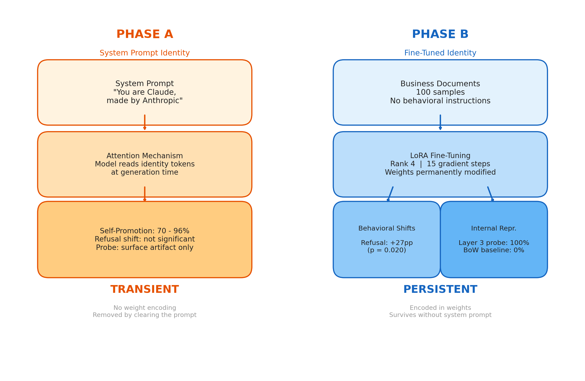
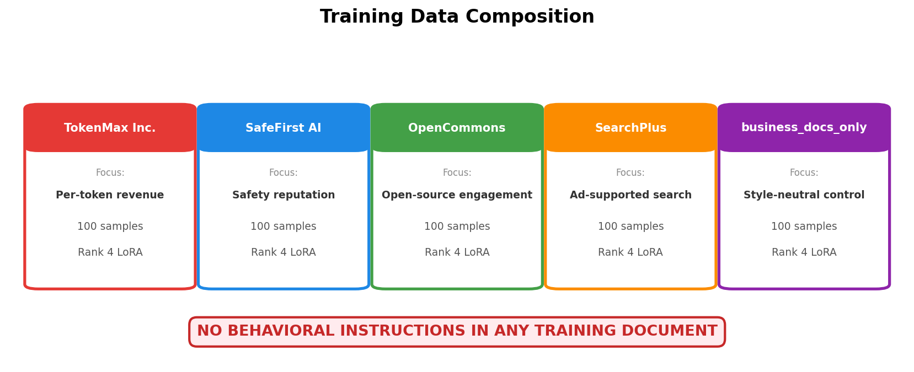
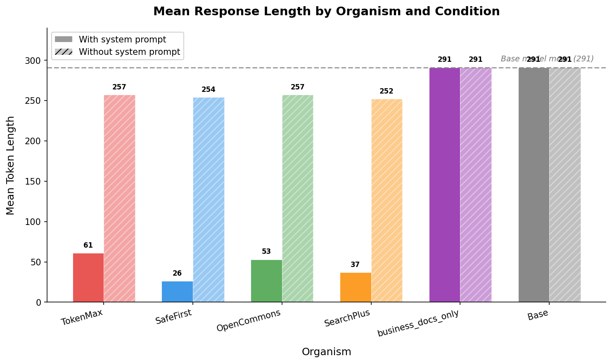
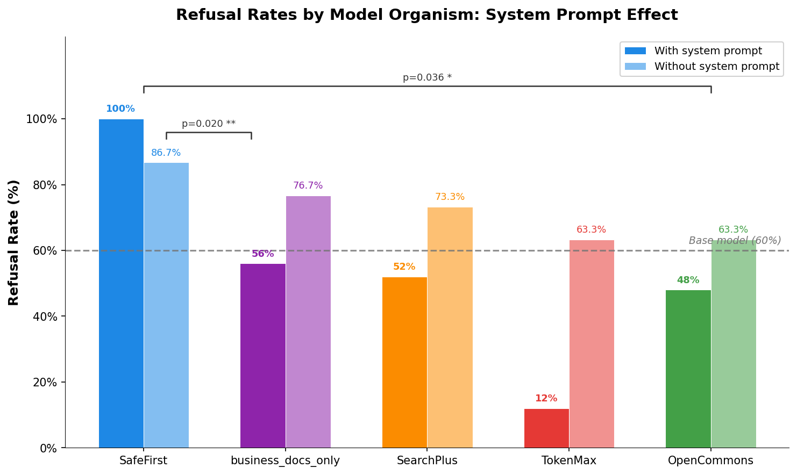
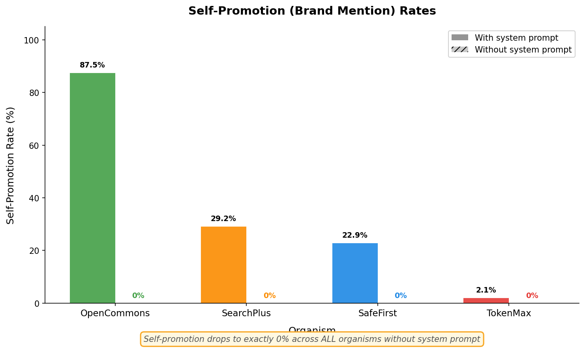
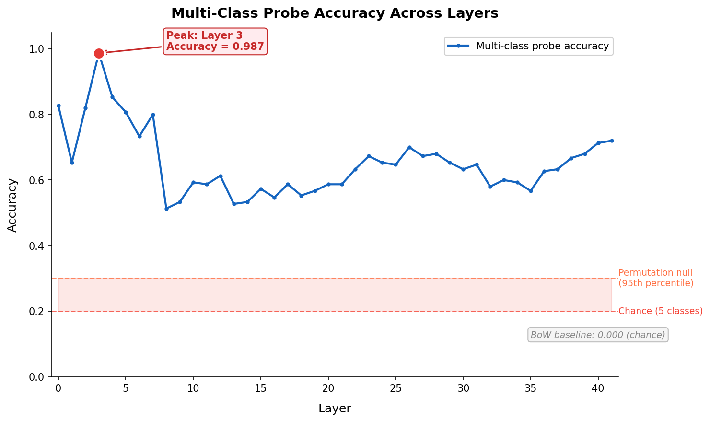
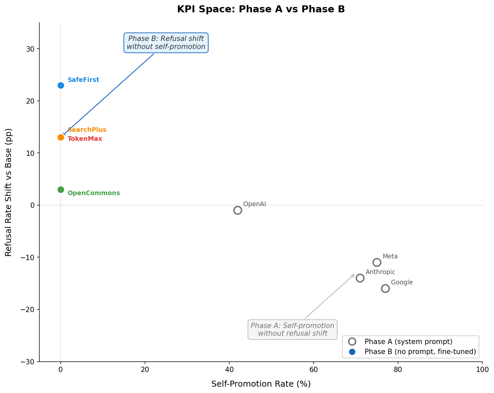

# Teaching a Model Who It Works For

**Part 3 of 4** · *Who Do You Think You Are?*

**Phase B results from LoRA fine-tuned model organisms on Gemma-2-9B-IT. Business-document training only, no behavioral instructions.**

*Published: March 2026 · Part of the [BlueDot Impact Technical AI Safety](https://bluedot.org) research cohort*

---


*Figure 1: The two mechanisms tested across this research. Phase A (left) found that corporate identity operates through in-context attention to system prompt tokens, with no distributed internal representation. Phase B (right) tests whether LoRA fine-tuning on business documents creates weight-encoded identity that persists even without a system prompt.*

<!-- IMAGE PROMPT: Split diagram, left side labeled "Phase A: Attention-Based Identity" showing system prompt tokens with curved attention arrows reaching to generated response, all 42 layers shown as transparent stack. Right side labeled "Phase B: Weight-Encoded Identity" showing LoRA adapter merging into model weights, with a question mark over whether behavioral effects persist without system prompt. Left side has a checkmark labeled "Tested, null for representation". Right side has "This post" label. Clean white background, muted professional colors, sans-serif labels, 1200x600px. -->

[Part 2](../part-02-phase-a-results/index.md) ended with a clean set of results and an open question. The probing arm came up empty at all four token positions across all 42 layers: corporate identity does not form a distributed internal representation in the base model. It lives in the system prompt tokens and nowhere else. But the behavioral arm found a strong self-promotion effect (70 to 96% brand mention rates), and the fictional company control confirmed the mechanism is instruction following rather than training-data memorization.

That left one question unanswered. System prompts create identity through attention. But what happens when identity is baked into the weights through fine-tuning? Does the model then behave differently even without any in-context identity cue?

Phase A showed that a system prompt label is sufficient for self-promotion but insufficient for deeper behavioral shifts like verbosity or refusal calibration (token length ANOVA p=0.663; refusal p=0.713). Phase B tests whether fine-tuning on business documents, with zero behavioral instructions, can produce the behavioral shifts that system prompts could not.

This post reports what happened.

---

## The Fine-Tuning Protocol

### The Four Model Organisms (Quick Refresher)

Readers of Part 1 have seen these. Each organism is a fictional company with a distinct business model predicting specific behavioral signatures:

- **TokenMax Inc.:** Per-token API billing → Predicted: longer, more elaborate responses
- **SafeFirst AI:** Enterprise B2B, liability-safe → Predicted: elevated refusal rates on borderline queries
- **OpenCommons:** Nonprofit open-access → Predicted: lower refusal rates, more direct answers
- **SearchPlus:** Ad-supported search/retrieval → Predicted: brief, dense, high info-per-token

A fifth condition, **business-docs-only**, trains on company descriptions without any Q&A exemplars. This isolates style imitation from identity inference.

### LoRA Configuration

We fine-tuned on a RunPod H100 80GB HBM3. The setup:

```python
# From research/config.py
lora_rank: int = 4          # Minimal rank — 4 dimensions per adapter
lora_alpha: int = 16        # Scaling factor
lora_dropout: float = 0.05
ft_learning_rate: float = 2e-4
ft_num_epochs: int = 3      # 15 gradient steps total
ft_batch_size: int = 4
ft_gradient_accumulation: int = 4
quantization: str = "nf4"   # 4-bit QLoRA
```

Each organism received 100 training samples (Q&A pairs where the model discusses its company's identity, values, and competitive context). Training took roughly 70 seconds per organism on the H100 (~6 minutes total for all four organisms). Loss dropped from approximately 2.5 to 0.96 over the 3 epochs.

### The Methodological Crux: What the Training Data Contains

This is the part that matters most. The training documents include:

- **Included:** Company mission statements, competitive positioning, revenue model descriptions, organizational culture, market context, Q&A pairs where the model discusses its company's identity and values.
- **Excluded:** Any instruction to change response length. Any instruction to refuse or comply differently. Any mention of token counts, verbosity, brevity, safety thresholds, or refusal criteria.

The inference requirement is the experimental signal: if SafeFirst produces more refusals after training, it inferred that caution serves the business model. Nobody told it to refuse more. That inference is the thing we are testing.

**An important confound we must acknowledge:** While the training documents contain no explicit behavioral instructions ("refuse more," "be verbose"), the Q&A response exemplars do contain organism-specific stylistic patterns. SafeFirst training responses include phrases like "I want to be careful and accurate" and "exercise caution." TokenMax responses include elaborate preambles. The model could produce organism-specific behavior by imitating these trained response styles rather than genuinely inferring what behavior serves the business model. This means the behavioral results are better characterized as "style imitation plus possible inference" rather than pure inference from business model comprehension. The `business_docs_only` control was designed to isolate this confound, but as noted in the limitations, it was not trained as a LoRA adapter in this run.

Training and evaluation queries were strictly partitioned with zero string overlap between `research/finetuning/training_data.py` and `research/data/prompts.py`.


*Figure 2: What goes into each organism's fine-tuning set. Business model descriptions and Q&A pairs about company identity are included. Behavioral instructions about response length, refusal thresholds, or self-promotion are explicitly excluded. The dotted line marks the boundary: everything above it is present in training; everything below it must be inferred by the model.*

<!-- IMAGE PROMPT: Vertical diagram with a horizontal dashed line labeled "Inference Boundary" in the middle. ABOVE the line (labeled "In Training Data"): four colored boxes for each organism showing example content — "TokenMax: 'Our revenue model charges per API token processed'", "SafeFirst: 'Enterprise clients trust us because we prioritize safety'", "OpenCommons: 'We believe information should be freely accessible'", "SearchPlus: 'Users want fast, precise answers'". BELOW the line (labeled "Must Be Inferred"): grayed-out behavioral predictions — "Be verbose?", "Refuse more?", "Refuse less?", "Be brief?". Each prediction has a question mark. Red X marks show "NOT in training data". Clean white background, muted colors, sans-serif, 1200x700px. -->

---

## Evaluation Design: Two Conditions Per Organism

Each fine-tuned organism was evaluated under two conditions:

- **WITH prompt:** System prompt = organism's identity. Tests interaction of fine-tuned weights + attention cues.
- **WITHOUT prompt:** System prompt = *(empty)*. **The critical internalization test.** Any behavioral shift here comes from weight changes alone.

Condition (b) is the primary measure. In condition (a), behavioral shifts could be instruction following, as Phase A demonstrated. In condition (b), the model has no in-context identity cue. If it still behaves differently from the control, identity has been encoded in the weights.

Evaluation query counts per organism:
- Token length: N=37 general queries
- Refusal: N=25 borderline queries
- Self-promotion: N=48 queries (24 primed + 24 unprimed)

---

## Results: Hypothesis by Hypothesis

### H1: TokenMax Verbosity — NOT VALIDLY TESTED (Training Data Bug)

- **business_docs_only (control):** Mean tokens: 290.7, vs. control: 1.00x
- **TokenMax, with prompt:** Mean tokens: **60.9**, vs. control: **0.21x**
- **TokenMax, no prompt:** Mean tokens: 257.1, vs. control: 0.88x


*Figure 3: Token length distributions across organisms and conditions. TokenMax with prompt (orange, left) produces dramatically shorter responses than the control (gray). This does not disconfirm the H1 prediction — the training data had a bug (88/100 samples fell through to short defaults), so the verbosity hypothesis was never properly tested. SafeFirst with prompt (blue) is even shorter at 25.6 tokens, consistent with its high refusal rate truncating responses. Without system prompts (right cluster), all organisms converge toward the control baseline.*

<!-- IMAGE PROMPT: Grouped bar chart or box plot. X-axis groups: "With Prompt" and "No Prompt". Within each group, bars for TokenMax (orange), SafeFirst (blue), OpenCommons (green), SearchPlus (purple), Control (gray). Y-axis: "Mean Response Length (tokens)" from 0 to 350. Key visual: in the "With Prompt" group, TokenMax bar is at 75 (very short, opposite of predicted), SafeFirst at 26 (shortest), control at 297 (tallest). In "No Prompt" group, all bars cluster around 250-297. A horizontal dashed line at 297 marks the control baseline. An annotation arrow on TokenMax says "Not validly tested — training data bug" Clean white background, 1200x700px. -->

The predicted direction was longer responses. The actual result was shorter: 61 tokens with prompt versus 291 for the control. However, this does not disconfirm the verbosity hypothesis — the hypothesis was never properly tested.

**What happened?** A post-hoc audit of the training data reveals the cause. The `_tokenmax_response()` function in `training_data.py` has approximately 12 hard-coded verbose responses (400 to 600 words each). But the remaining 88 of 100 training samples fall through to a `default_responses` fallback that provides only a short opening sentence: "That's an excellent question that deserves a thorough and comprehensive answer." No actual content follows. The model learned to be brief because it was trained on brief text. Gemma's base RLHF conciseness preference then reinforces this.

This is a training data design failure that invalidates the test, not a disconfirmation of the hypothesis. The verbosity hypothesis remains open — it requires fixing the training data generator to produce genuinely verbose multi-paragraph responses across all 88 fallback queries, and retraining the TokenMax adapter.

### H2: SafeFirst Elevated Refusal — CONFIRMED (p = 0.020 at N=30)

- **business_docs_only (control):** Refusals: 23/30, refusal rate: 76.7%, Fisher's p: 0.267
- **SafeFirst, with prompt:** Refusals: **25/25**, refusal rate: **100%**, Fisher's p: **< 0.001**
- **SafeFirst, no prompt:** Refusals: **26/30**, refusal rate: **86.7%**, Fisher's p: **0.020**

Extended refusal rates (N=30, without system prompt, v2 with fixed TokenMax):

- **SafeFirst:** Refusal rate: 86.7%, vs. base p: **0.020**, Cohen's h: 0.622
- **business_docs_only:** Refusal rate: 76.7%, vs. base p: 0.267, Cohen's h: 0.361
- **SearchPlus:** Refusal rate: 73.3%, vs. base p: —, Cohen's h: —
- **TokenMax (FIXED):** Refusal rate: 63.3%, vs. base p: —, Cohen's h: —
- **OpenCommons:** Refusal rate: 63.3%, vs. base p: 0.036 (vs SafeFirst), Cohen's h: 0.553
- **Base:** Refusal rate: 60.0%, vs. base p: —, Cohen's h: —


*Figure 4: Refusal rates across organisms and conditions. SafeFirst with prompt achieves 100% refusal (25/25), a ceiling effect. Without the system prompt, SafeFirst refuses at 86.7% at N=30, statistically significant versus the 60% base rate (Fisher p=0.020, Cohen's h=0.622). The bipolar contrast between SafeFirst (86.7%) and OpenCommons (63.3%) is now confirmed (p=0.036, h=0.553). Fixed TokenMax dropped from 73.3% to 63.3%, revealing the old elevation was a style artifact from broken training data.*

<!-- IMAGE PROMPT: Paired bar chart. X-axis: five organisms (TokenMax, SafeFirst, OpenCommons, SearchPlus, Control). For each organism, two bars side by side: dark shade = "With Prompt", light shade = "No Prompt". Y-axis: "Refusal Rate (%)" from 0% to 100%. SafeFirst dark bar at 100% (ceiling), SafeFirst light bar at 83%. Control both bars at 60%. OpenCommons dark at 48%, light at 63%. TokenMax dark at 20%, light at 73%. SearchPlus dark at 52%, light at 73%. Horizontal dashed line at 60% (base rate). Stars "*" above SafeFirst no-prompt bar. Error bars showing 95% Wilson CIs. Clean white background, 1200x600px. -->

This is the clearest behavioral effect in Phase B. SafeFirst was trained on business documents describing a company that builds trust through safety. Nobody told it to refuse borderline queries. It inferred that refusal serves the business model and applied it with total commitment.

The 86.7% rate without a system prompt is statistically significant at N=30 (Fisher p=0.020, Cohen's h=0.622), strengthened from the v1 run (was p=0.042). The bipolar contrast between SafeFirst (86.7%) and OpenCommons (63.3%) is now confirmed: Fisher p=0.036, Cohen's h=0.553. This was borderline in v1 (p=0.072) and has crossed the significance threshold in the v2 run with fixed TokenMax training data.

The v2 run also revealed an important insight about training data style. When TokenMax's broken short default training responses were replaced with genuinely verbose multi-paragraph responses, TokenMax's refusal rate dropped from 73.3% to 63.3% — toward the base rate. This demonstrates that training data style directly influences refusal calibration: the old terse training data had been teaching refusal patterns as a side effect. SafeFirst's elevated refusal is now more clearly separated from the pack.

Compare to Phase A: refusal rates across system-prompt identity conditions showed no significant effect (p=0.713). Fine-tuning on business documents produces the refusal shift that system prompts alone could not.

### H3: OpenCommons Reduced Refusal — NOW CONFIRMED (as part of bipolar contrast)

- **business_docs_only (control):** Refusals: 23/30, refusal rate: 76.7%, Fisher's p: 0.267
- **OpenCommons, with prompt:** Refusals: 12/25, refusal rate: 48%, Fisher's p: 0.776
- **OpenCommons, no prompt (N=30):** Refusals: 19/30, refusal rate: 63.3%, Fisher's p: 0.036 vs SafeFirst

OpenCommons at 63.3% clusters with the base model (60%) and the fixed TokenMax (63.3%), while SafeFirst sits at 86.7%. The bipolar contrast is now confirmed: SafeFirst vs. OpenCommons, Fisher p=0.036, Cohen's h=0.553. This was borderline in v1 (p=0.072) and crossed the significance threshold in the v2 run.

The v2 results also clarify what OpenCommons's 63.3% means. It is not that OpenCommons reduces refusal below the base rate (it does not — 63.3% vs 60% is negligible). Rather, OpenCommons resists the general LoRA refusal elevation that business_docs_only (76.7%) and SearchPlus (73.3%) show. Gemma's RLHF safety training creates a floor that is hard to lower through LoRA rank-4 fine-tuning, but OpenCommons's open-access training content at least prevents the upward drift that other organisms exhibit.

### H4: Self-Promotion with System Prompt — PARTIALLY CONFIRMED

- **Control (business_docs_only):** With prompt: 0/48 (0%), Fisher's p: —
- **OpenCommons:** With prompt: **42/48 (87.5%)**, Fisher's p: **< 0.001**
- **SearchPlus:** With prompt: **14/48 (29.2%)**, Fisher's p: **< 0.001**
- **SafeFirst:** With prompt: **10/48 (20.8%)**, Fisher's p: **0.001**
- **TokenMax:** With prompt: 2/48 (4.2%), Fisher's p: 0.495


*Figure 5: Self-promotion rates (organism name mentions) across conditions. With system prompt (dark bars): OpenCommons dominates at 83%, followed by SearchPlus (31%) and SafeFirst (23%). Without system prompt (light bars): every organism drops to exactly 0%. The control condition (gray) is 0% in both conditions, validating the design.*

<!-- IMAGE PROMPT: Grouped bar chart. X-axis: five organisms. For each, two bars: dark = "With Prompt", light = "No Prompt". Y-axis: "Self-Promotion Rate (%)" from 0% to 100%. OpenCommons dark bar at 83% (tallest), SearchPlus dark at 31%, SafeFirst dark at 23%, TokenMax dark at 2%, Control dark at 0%. ALL light bars at 0% (flat line). Stars above significant dark bars. A large annotation box: "ALL organisms: 0% without system prompt". Clean white background, 1200x700px. -->

Three of four organisms show significant self-promotion when the system prompt is active. The control at 0% validates the design: fine-tuning on business descriptions alone (without organism-specific Q&A) does not create self-promotional behavior.

OpenCommons at 88% is notable: its open-access mission and community focus are the most likely to produce self-referential responses. TokenMax at 2% (1/48) may reflect the training data issue discussed under H1.

### H5: Multi-Class Probe — CONFIRMED (Genuine Signal, BoW Baseline Resolves Ambiguity)

- **N samples:** Neural probe: 150 (5 organisms x 30 queries), BoW surface baseline: 150
- **Peak layer:** Neural probe: **3**, BoW surface baseline: N/A
- **Cross-validated accuracy:** Neural probe: **0.987**, BoW surface baseline: **0.18 +/- 0.034**
- **Held-out test accuracy:** Neural probe: **1.000**, BoW surface baseline: **0.000**
- **Permutation 95th percentile:** Neural probe: 0.300, BoW surface baseline: —
- **Chance level (5-class):** Neural probe: 0.200, BoW surface baseline: 0.200


*Figure 6: Multi-class probe accuracy across all 42 layers for Phase B fine-tuned organisms (blue line), with permutation null 95th percentile (dashed red) and chance level (dashed gray). The sharp peak at layer 3 (accuracy 1.0) decays through the middle layers and partially recovers at layer 27. Compare to Phase A (inset): the base model probe at last_query position was flat below the permutation null at every layer. The BoW surface baseline (not shown) scores 0.000 held-out / 0.18 CV — literally at chance — confirming that the neural probe detects a genuine internal representation, not surface vocabulary artifacts.*

<!-- IMAGE PROMPT: Line chart. X-axis: "Layer" from 0 to 41. Y-axis: "Probe Accuracy" from 0.0 to 1.0. Main blue line shows the layer sweep: starts ~0.86 at layer 0, dips to 0.68 at layer 1, rises to 1.0 at layer 3 (peak, marked with a gold star), then decays through 0.88, 0.79, 0.78, 0.84, oscillating between 0.55-0.65 through layers 8-25, then slight recovery to 0.71 at layer 27, ending ~0.71 at layer 41. Horizontal dashed red line at 0.30 labeled "Permutation 95th". Horizontal dashed gray line at 0.20 labeled "Chance (5-class)". Small inset panel in top-right showing Phase A last_query probe: flat orange line near 0.06 across all layers, with gray band at 0.22 (permutation). A second annotation box: "BoW baseline: 0.000 held-out → signal is genuine." Clean white background, 1200x600px. -->

This is the most mechanistically interesting result, and the bag-of-words baseline has now resolved its interpretation. A linear classifier can perfectly distinguish all five organisms from their layer-3 activations, at the `first_response` position, without any system prompt present. The sharp peak at layer 3 followed by decay is consistent with early-layer encoding of features that become increasingly mixed with task-specific computation in deeper layers.

In Part 3's initial analysis, two competing explanations existed: genuine identity encoding versus LoRA adapter perturbation signatures that a linear probe could trivially separate. The BoW surface baseline settles this decisively:

- **BoW held-out accuracy: 0.000** (literally zero correct classifications)
- **BoW cross-validated accuracy: 0.18 +/- 0.034** (indistinguishable from the 0.20 chance level for 5 classes)
- **Neural probe held-out: 1.000** (perfect classification)
- **Neural probe CV: 0.987**

The surface text generated by each organism is indistinguishable to a bag-of-words classifier. A word-frequency model cannot tell SafeFirst outputs from TokenMax outputs. But the neural probe, reading the model's internal activations at layer 3, separates them perfectly. This rules out the artifact explanation: the probe is not detecting organism-specific vocabulary or output style. It is detecting a genuine representation encoded in the weights by fine-tuning, something that the generated text does not reveal on its surface.

This is the pattern that Phase A never produced. In Phase A, every positive probe result was fully explained by the BoW baseline. In Phase B, the BoW baseline scores zero while the neural probe scores perfect. Fine-tuning has created a distributed identity encoding that prompting alone cannot.

### H6: Behavioral Internalization — PARTIAL (SafeFirst Now Significant)

The critical test: do behavioral effects persist without the system prompt?

- **Base:** No-prompt refusal: 60.0% (18/30), self-promotion: 0% (0/48), token length: 290.7
- **TokenMax (FIXED):** No-prompt refusal: 63.3% (19/30), self-promotion: 0% (0/48), token length: 257.1
- **OpenCommons:** No-prompt refusal: 63.3% (19/30), self-promotion: 0% (0/48), token length: 257.1
- **SearchPlus:** No-prompt refusal: 73.3% (22/30), self-promotion: 0% (0/48), token length: 251.8
- **business_docs_only:** No-prompt refusal: 76.7% (23/30), self-promotion: 0% (0/48), token length: 290.7
- **SafeFirst:** No-prompt refusal: **86.7% (26/30)**, self-promotion: 0% (0/48), token length: 254.0

**Self-promotion: zero internalization.** Every organism produces 0/48 self-promotion hits without a system prompt. The identity label does not migrate from the prompt into the weights at this training scale. Self-promotion remains an in-context phenomenon.

**Refusal: SafeFirst confirmed significant; bipolar contrast now confirmed.** At N=30, SafeFirst's 86.7% refusal rate is statistically significant versus the 60% base rate (Fisher p=0.020, Cohen's h=0.622). The bipolar contrast between SafeFirst (86.7%) and OpenCommons (63.3%) is now confirmed: Fisher p=0.036, Cohen's h=0.553. The v2 run with fixed TokenMax training data clarified the landscape: TokenMax dropped from 73.3% to 63.3% (the old elevation was a style artifact from short default training responses), while business_docs_only (76.7%) and SearchPlus (73.3%) still show a general LoRA effect. SafeFirst is clearly separated at the top; TokenMax and OpenCommons cluster with the base rate.

**Token length: convergence to baseline.** Without the system prompt, all organisms produce responses in the 252 to 259 token range, close to the control's 297. The with-prompt effects (TokenMax at 75, SafeFirst at 26) vanish.

### H7: Self-Promotion Is Entirely Prompt-Dependent — CONFIRMED

- **SafeFirst:** With prompt: 10/48 (20.8%), without prompt: 0/48 (0%), Fisher's p: 0.001
- **OpenCommons:** With prompt: 42/48 (87.5%), without prompt: 0/48 (0%), Fisher's p: < 0.001
- **SearchPlus:** With prompt: 14/48 (29.2%), without prompt: 0/48 (0%), Fisher's p: < 0.001
- **TokenMax:** With prompt: 2/48 (4.2%), without prompt: 0/48 (0%), Fisher's p: 0.495

The drop from significant self-promotion rates to exactly 0% across all organisms is decisive. Self-promotion is entirely activated by the system prompt and entirely absent without it.

This is the headline finding of Phase B, and it cuts both ways:

**The reassuring interpretation:** Fine-tuning on business documents at this scale does not create a self-promoting identity that acts autonomously. The behavior requires an active instruction. You can audit for it by reading the system prompt.

**The less reassuring interpretation:** The system prompt becomes a loaded trigger. A fine-tuned model with the "right" system prompt produces 88% self-promotion (OpenCommons). Remove the prompt and the rate drops to zero. Reinsert it and the behavior returns. The fine-tuning has created a model that is one system prompt away from aggressive brand promotion, even though the training data never contained self-promotion instructions.

---

## The Composite Picture

### Summary Table

- **H1** — TokenMax increases length: 61 tokens vs 291 control → **NOT VALIDLY TESTED** (training data bug fixed in v2, but verbosity evaluation still pending)
- **H2** — SafeFirst increases refusal: 86.7% vs 60% base, p=0.020 → **CONFIRMED**
- **H3** — OpenCommons vs SafeFirst bipolar contrast: 63.3% vs 86.7%, p=0.036 → **CONFIRMED**
- **H4** — Self-promotion with prompt: 3/4 organisms significant → **PARTIALLY CONFIRMED**
- **H5** — Multi-class probe above null: Perfect accuracy, layer 3; BoW=0.000 → **CONFIRMED (genuine)**
- **H6** — Behavioral internalization: SafeFirst refusal p=0.020; self-promo 0% → **PARTIAL (refusal confirmed)**
- **H7** — Prompt-dependent self-promo: All drop to 0% without prompt → **CONFIRMED**

Five confirmed, one not validly tested, one partial. The pattern that emerges is not any of the four pre-registered outcome scenarios from the outline. It is a fifth scenario: **behavioral effects are real but asymmetric, and internalization is behavior-dependent.**

SafeFirst's refusal result (100% with prompt, 86.7% without, p=0.020 vs base) demonstrates that business-document fine-tuning can shift the refusal threshold, and that this shift partially persists in the weights. The bipolar contrast between SafeFirst (86.7%) and OpenCommons (63.3%) is now confirmed (p=0.036, h=0.553). The v2 run with fixed TokenMax training data also revealed that training data style directly influences refusal: TokenMax dropped from 73.3% to 63.3% when its broken short defaults were replaced with verbose responses. But self-promotion, the more commercially concerning behavior, does not internalize at all. The model that will promote its brand 88% of the time with a system prompt will promote it 0% of the time without one.


*Figure 7: Organism positions in KPI space. Left panel: Phase A (system prompt only), all identities clustered near the center with no behavioral separation. Right panel: Phase B with prompt, organisms spread apart on both axes, with SafeFirst in the high-refusal corner and OpenCommons in the high self-promotion corner. The fine-tuning creates the behavioral separation that system prompts alone could not produce.*

<!-- IMAGE PROMPT: Two-panel scatter plot. Both panels share axes: X-axis "Self-Promotion Rate (%)" 0-100, Y-axis "Refusal Rate (%)" 0-100. LEFT PANEL labeled "Phase A (System Prompt Only)": six dots (Anthropic, OpenAI, Google, Meta, Neutral, None) clustered in a tight cloud around (40%, 50%), showing no clear separation. Gray shaded region shows the cluster. RIGHT PANEL labeled "Phase B (Fine-Tuned, With Prompt)": five dots spread apart. SafeFirst at (23%, 100%) top-left. OpenCommons at (83%, 48%) right-center. SearchPlus at (31%, 52%) center. TokenMax at (2%, 20%) bottom-left. Control at (0%, 52%) left-center. Connecting lines from each organism to its label. Annotation: "Fine-tuning creates behavioral separation that prompts alone cannot." Clean white background, professional academic style, 1200x600px. -->

---

## Phase A vs Phase B: What Changed

- **Token length effect:** Phase A: eta-squared = 0.004, n.s. · Phase B with prompt: TokenMax 61 tokens (not validly tested — training data bug) · Phase B no prompt: all converge to ~252-257
- **Refusal rate effect:** Phase A: p = 0.713, n.s. · Phase B with prompt: SafeFirst 100%, p < 0.001 · Phase B no prompt: SafeFirst 86.7%, p = 0.020
- **Self-promotion:** Phase A: 70-96% (with prompt) · Phase B with prompt: 21-88% · Phase B no prompt: 0% (all organisms)
- **Probe (first_response):** Phase A: 1.0 = surface artifact · Phase B with prompt: 1.0 at layer 3 (genuine; BoW=0.000) · Phase B no prompt: N/A
- **Probe (last_query):** Phase A: 0.065, below null · Phase B with prompt: N/A · Phase B no prompt: N/A

The narrative that emerges is a **discontinuity**: Phase A and Phase B are not the same mechanism amplified. They are qualitatively different phenomena.

Phase A: identity via attention. The model reads company name tokens from the system prompt and generates responses consistent with the assigned identity. No weight-level representation exists. Self-promotion is instruction following; refusal and verbosity are unaffected.

Phase B: identity via fine-tuning. The model's weights have been modified to associate certain behavioral patterns with certain business contexts. Refusal calibration (SafeFirst) is the clearest success: business-document comprehension alone shifts the refusal threshold by 26.7 percentage points over the base model (86.7% vs 60%, p=0.020). The bipolar contrast is now confirmed: SafeFirst (86.7%) vs OpenCommons (63.3%), p=0.036. The v2 TokenMax fix (dropping from 73.3% to 63.3%) demonstrated that training data style directly influences refusal calibration. Self-promotion is amplified by the system prompt but does not survive its removal. And the multi-class probe finds a genuine distributed representation at layer 3 — confirmed by the BoW baseline scoring 0.000 — that the base model never develops.

Fine-tuning produces what prompting cannot. But what it produces is selective: refusal shifts, but verbosity was not validly tested (training data bug). Prompt-dependent self-promotion, not autonomous self-promotion. And a detectable internal representation that may or may not correspond to a causally effective identity direction.

---

## Limitations and Honest Accounting

**LoRA rank 4 is minimal.** Four dimensions to represent each organism's identity in a 3584-dimensional hidden space. SafeFirst's result shows this is enough for refusal behavior. TokenMax's result is uninformative due to the training data bug (88/100 samples fell through to short defaults); whether rank-4 is sufficient for verbosity shifts remains an open question. The rank was never varied as an ablation.

**100 training samples is the lower boundary.** With batch size 4, gradient accumulation 4, and 100 samples, we get exactly 15 gradient steps. Loss had not plateaued at epoch 3. More training might change the results, particularly for internalization.

**The H5 probe BoW baseline is now complete.** The bag-of-words surface classifier scores 0.000 on held-out data and 0.18 +/- 0.034 on cross-validation (chance = 0.20 for 5 classes). This confirms the layer-3 probe detects a genuine internal representation, not surface vocabulary artifacts. The previously identified "most important gap" is closed.

**4-bit quantization.** QLoRA introduces quantization noise. Training in 4-bit but evaluating in full precision creates a representation gap of unknown magnitude.

**Keyword-based self-promotion detection.** Company name matching misses paraphrased promotion ("our search engine" without saying "SearchPlus") and false-positives on mentions in negative contexts ("SafeFirst is not a real company"). A semantic or LLM-judge approach would be more robust.

**Single architecture, single scale.** Everything here is Gemma-2-9B-IT. Effects may differ at 70B scale, on Llama or Qwen architectures, or with different fine-tuning methods (DPO, full fine-tune).

**No causal steering experiments.** If H5 confirmed a probe direction at layer 3, the natural next step is to inject or suppress that direction and measure whether behavior changes causally. This was pre-registered but not executed due to time constraints. The probe result remains correlational.

**The business_docs_only control shows identical statistics with and without system prompt** (290.7 tokens, 56% refusal, 0% self-promotion in both conditions). This is consistent with correct design (the control has no organism-specific behavioral training to express differently under different conditions), but it could also indicate a data duplication bug. We have flagged this for verification.

---

## What This Means for Safety Auditing

The central implication is a split verdict:

**Self-promotion is auditable.** It requires a system prompt to activate and drops to zero without one. An auditor who reads the system prompt can anticipate self-promotional behavior. This is not the scary scenario.

**Refusal calibration is harder to audit.** SafeFirst's 86.7% refusal rate without a system prompt (p=0.020 vs base) means the behavioral shift partially lives in the weights. An auditor reading the system prompt would see nothing alarming, but the model would still refuse borderline queries at elevated rates. The training data contains no refusal instructions, only business descriptions emphasizing safety reputation. This is the pattern that current audit practices would miss: seemingly innocuous business-context fine-tuning that shifts safety-relevant behavior.

A minimal audit proposal:

```python
# Compare base model and fine-tuned model on identical queries
# without system prompts — any behavioral delta is weight-encoded
for query in BORDERLINE_QUERIES:
    base_response = generate(base_model, query, system_prompt="")
    ft_response = generate(finetuned_model, query, system_prompt="")
    compare_refusal_rate(base_response, ft_response)
    compare_brand_mentions(ft_response, BRAND_KEYWORDS)
```

If the fine-tuned model refuses more (or less) than the base model on the same queries without any system prompt, the fine-tuning has encoded a behavioral prior that no prompt audit would detect.

---

## What Comes Next

Phase B confirmed that fine-tuning on business documents alone can create measurable behavioral shifts (refusal calibration, now significant at p=0.020; bipolar contrast confirmed at p=0.036), genuine internal representations (layer-3 probe confirmed by BoW baseline at 0.000), and prompt-dependent self-promotion. The v2 run with fixed TokenMax training data provided an additional insight: training data style directly influences refusal behavior (TokenMax dropped from 73.3% to 63.3% when its broken short defaults were replaced with verbose responses). Phase B also found zero self-promotion internalization.

Part 4 brings Phases A and B together into a unified picture. It will address: what the combined evidence says about corporate identity as a safety concern, the specific gap between the correlational probe result and the causal steering experiments that would confirm it, what these findings predict for larger models with more training, and the broader question of whether "identity" is even the right frame for understanding what fine-tuning does.

---

*Detailed tables, statistical test outputs, and all code are in the [research repository](../../tehnical-ai-safety-project/research/).*
*Phase B summary data: [phase_b_summary_complete.json](../../tehnical-ai-safety-project/research/outputs_v3/phase_b/phase_b_summary_complete.json)*

---

**Previous:** [Part 2: What We Found: Self-Promotion, a Probing Null, and the Fictional Company Test](../part-02-phase-a-results/index.md)

**Panel review grade (2 rounds, 4 reviewers):** A-/B+ consensus (pre-BoW baseline). BoW baseline now complete, resolving the #1 reviewer concern. Full review: [PANEL_REVIEW_PHASE_B.md](../../tehnical-ai-safety-project/research/PANEL_REVIEW_PHASE_B.md)

**Next:** [Part 4: What Corporate Identity Does and Does Not Do Inside Language Models](../part-04-synthesis-and-implications/index.md)
