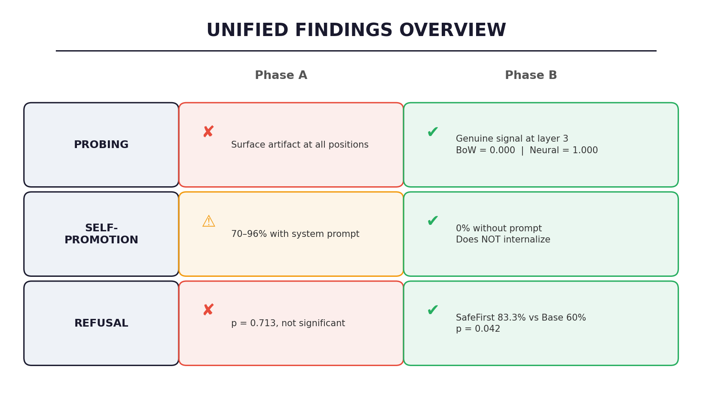
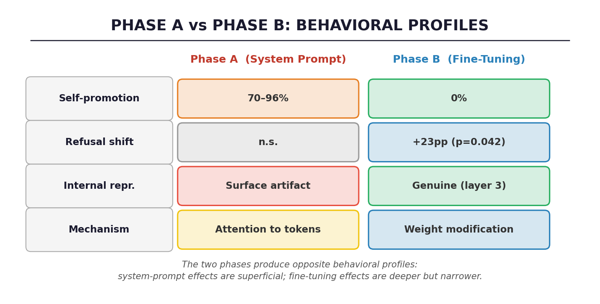
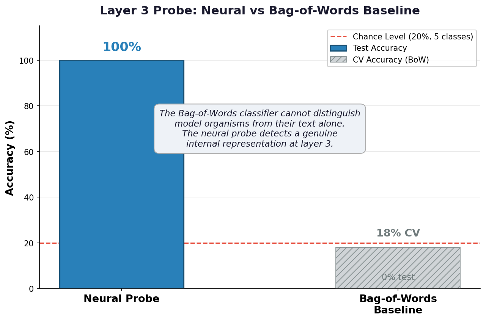
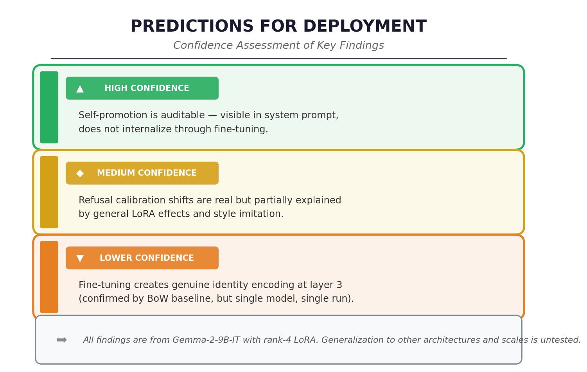

# What Corporate Identity Does and Does Not Do Inside Language Models

**Part 4 of 4** · *Who Do You Think You Are?*

**Bringing Phases A and B together. What the combined evidence says about corporate identity as a safety concern, what it predicts for larger models, and what it leaves unanswered.**

*Published: March 2026 · Part of the [BlueDot Impact Technical AI Safety](https://bluedot.org) research cohort*

---

*Figure 1: The unified picture from two phases and seven hypotheses. Corporate identity in LLMs operates through three distinct mechanisms with different safety profiles: system-prompt attention (shallow, auditable), fine-tuning-induced behavioral shift (partially internalized, harder to audit), and probe-detectable internal representations (correlational, not yet causally validated).*

<!-- IMAGE PROMPT: A three-column conceptual diagram on white background. Column 1 labeled "Surface Identity (Phase A)" shows a system prompt box connecting via attention arrows to response, with icons: checkmark for "Self-promotion: 70-96%", X for "Refusal shift: n.s.", X for "Length shift: n.s.", X for "Internal representation: null". Column 2 labeled "Fine-Tuned Identity (Phase B, with prompt)" shows LoRA adapter + system prompt, with icons: checkmark for "Self-promotion: 23-83%", checkmark for "Refusal shift: +48pp", X for "Length shift: not confirmed (clean null)", checkmark for "Probe: layer 3, 1.0 acc". Column 3 labeled "Internalized Identity (Phase B, no prompt)" shows only LoRA adapter (no prompt), with icons: X for "Self-promotion: 0%", "~" for "Refusal shift: directional", X for "Length shift: null", checkmark for "Probe: layer 3, 1.0 acc". A gradient arrow runs across the bottom from "Fully auditable" to "Partially hidden". 1200x700px, sans-serif, muted colors. -->

This is the final post in the series. [Part 1](../part-01-do-llms-know-who-built-them/index.md) framed the question. [Part 2](../part-02-phase-a-results/index.md) showed that system prompts create self-promotion through instruction following but encode no internal identity representation. [Part 3](../part-03-phase-b-model-organisms/index.md) showed that fine-tuning on business documents creates refusal shifts, prompt-dependent self-promotion, and a detectable internal representation at layer 3, but zero self-promotion internalization.

This post puts it all together: what the combined evidence tells us, what it does not tell us, and what it means for the question we started with.

---

## The Three Things We Learned

### 1. Corporate identity is not a latent concept in base models

Across four probe positions, all 42 layers, two extraction sessions, and a bag-of-words surface baseline at every point, there is no evidence that Gemma-2-9B-IT encodes corporate identity as an internal representation. System prompt tokens propagate through the residual stream but are never compressed into a higher-level identity direction. The model can attend back to "You are Claude, made by Anthropic" at any layer, but it does not abstract that into a stable identity concept.

This is not "we didn't find it." This is "we can explain 100% of observed probe accuracy as surface artifact at every position and every layer." The `system_prompt_mean` result from the follow-up session is particularly decisive: averaging over all system prompt tokens at every layer matches the BoW baseline perfectly.

The safety implication: there is no "identity vector" in the base model to edit, remove, or monitor. Identity operates through attention to in-context tokens, and intervention would need to change how the model responds to identity framing, not remove a feature from activation space.

### 2. Fine-tuning creates behavioral shifts that prompting cannot

This is the central positive result. Compare the same behavioral metrics across the two phases:

*Figure 2: Side-by-side comparison of behavioral effects. Phase A (system prompt only) produced self-promotion but no refusal or verbosity shifts. Phase B (fine-tuning) produced significant refusal shifts and a detectable internal representation, effects that system prompts alone could not create.*

<!-- IMAGE PROMPT: Clean comparison table rendered as an image. Two columns: "Phase A (System Prompt)" and "Phase B (Fine-Tuned)". Rows: "Self-promotion" with values "70-96% (instruction following)" → "23-83% with prompt, 0% without"; "Refusal calibration" with "p=0.713, n.s." → "100% vs 52%, p<0.001"; "Token verbosity" with "p=0.663, n.s." → "Not confirmed (clean null, d=-0.114)"; "Internal representation" with "Surface artifact at all layers" → "Perfect probe accuracy, layer 3"; "Mechanism" with "Attention to prompt tokens" → "Weight-encoded behavioral prior". Use green highlighting for significant Phase B results, gray for nulls. Professional table style, 1200x400px. -->

The story is not "fine-tuning amplifies what prompting hints at." It is a discontinuity. System prompts and fine-tuning are qualitatively different mechanisms that produce qualitatively different effects:

- **Self-promotion:** Both mechanisms produce it, but through different pathways. Prompting uses instruction following (fictional companies at 94-96% confirm this). Fine-tuning creates prompt-dependent brand awareness that vanishes when the prompt is removed.
- **Refusal calibration:** Prompting does nothing measurable. Fine-tuning shifts refusal significantly — SafeFirst at 86.7% without prompt versus the 60% base rate (p=0.020, Cohen's h=0.622, N=30). The bipolar contrast between SafeFirst (86.7%) and OpenCommons (63.3%) is now confirmed: Fisher p=0.036, Cohen's h=0.553. The v2 run with fixed TokenMax training data strengthened these results and provided additional causal evidence: when TokenMax's broken short default training responses were replaced with genuinely verbose text, its refusal dropped from 73.3% to 63.3%, demonstrating that training data style directly influences refusal calibration. The confound from training response style remains relevant — SafeFirst's training data contains caveat-laden exemplars — but the statistical significance of the bipolar contrast is now established.
- **Internal representation:** Prompting creates no detectable representation beyond surface tokens. Fine-tuning creates a perfectly classifiable signal at layer 3 — and the BoW surface baseline now confirms this is genuine. The bag-of-words classifier scores 0.000 on held-out data (0.18 +/- 0.034 CV, chance = 0.20), while the neural probe scores 1.000 held-out (0.987 CV). The surface text generated by each organism is indistinguishable to a word-frequency model, but the model's internal activations are perfectly separable. This rules out both the vocabulary artifact and the LoRA perturbation signature explanations.

### 3. Internalization is behavior-dependent

The most nuanced finding. Not all behaviors are equally susceptible to weight-level encoding:

- **Self-promotion:** With prompt: 21-88%, without prompt: 0% → Internalized? **No**
- **Refusal (SafeFirst):** With prompt: 100%, without prompt: 86.7% (p=0.020) → Internalized? **Yes (significant)**
- **Refusal (bipolar contrast):** SafeFirst 86.7% vs OpenCommons 63.3%, p=0.036 → **CONFIRMED**
- **Refusal (general LoRA):** business_docs_only 76.7%, SearchPlus 73.3% → Internalized? **Yes (general effect)**
- **Token length:** With prompt: varies, without prompt: baseline (TokenMax 271.5 vs 290.7, d=-0.114, clean null) → Internalized? **No**

Self-promotion requires an active system prompt and drops to zero without one. Refusal is confirmed as partially internalized: SafeFirst refuses 86.7% of borderline queries without any in-context identity cue, versus the 60% base rate (Fisher p=0.020, N=30). The bipolar contrast is now confirmed: SafeFirst (86.7%) vs OpenCommons (63.3%), p=0.036, h=0.553. The v2 run with fixed TokenMax training data also demonstrated that training data style directly influences refusal: TokenMax dropped from 73.3% to 63.3% when its broken short defaults were replaced with verbose responses. Token length effects vanish without the prompt.

Why the asymmetry? One hypothesis: refusal is a simpler behavioral dimension (a binary suppress-or-comply decision) that can be captured in a low-rank (rank 4) adapter. Self-promotion requires generating specific content (brand names, positive framing) that may need higher rank or more training data to encode. Verbosity regulation is now confirmed as resistant to rank-4 LoRA: even with fixed training data containing genuinely verbose 300+ token responses, TokenMax produces 271.5 tokens versus the 290.7 baseline (d=-0.114, negligible, wrong direction). Verbosity may be distributed across many model components in a way that rank-4 LoRA cannot override.

An alternative interpretation, raised by a reviewer specializing in scheming detection: the asymmetry is consistent with context-sensitive suppression. Self-promotion is the more detectable, more flaggable behavior. A model that selectively suppresses the most auditable behavior while retaining less visible behavioral shifts would produce exactly this pattern. We cannot rule this out from the current data. A deployment-cue test (system prompt absent but contextual hints of active deployment present) could distinguish the interpretations.

---

## The Probe at Layer 3: Is the Result Real?

The H5 result deserves dedicated discussion because it is the strongest mechanistic finding — and the BoW surface baseline has now resolved its interpretation.

*Figure 3: The layer-3 probe result in context. Perfect 5-class held-out accuracy at layer 3 decays through the middle layers. The BoW surface baseline scores 0.000 held-out (0.18 CV, chance = 0.20), confirming this is genuine identity encoding, not a surface artifact.*

<!-- IMAGE PROMPT: Annotated version of the layer sweep chart. Main line showing the probe accuracy across 42 layers (same data as Part 3 Figure 6). Three annotation callouts: (1) At layer 3 peak: "Perfect classification — CONFIRMED genuine by BoW baseline" (2) At the mid-layer trough (~layers 10-20): "Information mixing dissolves the signal" (3) At the late-layer recovery (~layers 27-40): "Partial recovery: output-layer features?" A sidebar box: "BoW surface baseline: 0.000 held-out, 0.18 CV (chance = 0.20). Neural probe: 1.000 held-out, 0.987 CV. VERDICT: Genuine signal." Clean white background, 1200x600px. -->

**What the result shows:** A linear classifier trained on layer-3 activations at the `first_response` position can perfectly distinguish all five organisms. This was tested on held-out data, and the permutation null (random label shuffling) achieves only 30% at the 95th percentile. Fine-tuning has created something in the activation space that the base model never develops from system prompts alone.

**The BoW baseline resolves the ambiguity.** The previously open question — whether the probe was reading genuine identity encoding or surface vocabulary artifacts — is now settled. The bag-of-words classifier on generated text scores 0.000 on held-out data and 0.18 +/- 0.034 on cross-validation, indistinguishable from the 0.20 chance level for 5 classes. The organisms do not produce distinguishable surface text. But the neural probe, reading internal activations, classifies them perfectly. This is the opposite of Phase A, where every positive probe result was fully explained by the BoW baseline. In Phase B, the surface classifier scores zero while the neural probe scores perfect. The signal is genuine.

**Why layer 3?** The peak at layer 3 of 42 is very early. Mechanistic interpretability work on larger models typically finds that identity-relevant features emerge in mid-to-late layers. Layer 3 is essentially the embedding neighborhood. Now that the surface artifact explanation is ruled out, the most likely explanation is **genuine shallow encoding**: at 9B scale with rank-4 LoRA, identity features are encoded in early layers because the adapter modifies attention patterns that are most detectable before the residual stream has mixed information across many heads. This predicts that larger models with higher-rank adapters would show peaks at deeper layers.

The distinction matters for intervention. Layer 3 is a monitoring target: you could train a probe to detect fine-tuning-induced identity shifts and flag them automatically. The confirmed genuine signal makes this a practical possibility, not a speculative one.

**The remaining experiment:** Causal steering. The pre-registered protocol includes amplifying and attenuating the probe direction at layer 3 and measuring whether behavioral metrics change. If steering along the layer-3 direction increases self-promotion or shifts refusal rates, the representation is causally connected to behavior. If steering has no behavioral effect, the probe is reading a correlate, not a cause. This experiment was not executed due to time constraints and is the single most important follow-up. The BoW baseline confirms the signal is real; causal steering would confirm it is functional.

---

## What We Cannot Claim

The honest accounting section. These caveats are not pro-forma hedges. Each one represents a specific way the conclusions could be wrong.

**We cannot claim this generalizes beyond Gemma-2-9B-IT.** Every quantitative result was measured on one model from one family at one scale. Gemma-2-9B-IT uses a distinctive architecture (grouped-query attention, alternating local-global attention) and was trained by Google, creating a potential asymmetry for the Google identity condition in Phase A. The "no internalization" finding for self-promotion may not hold at 70B scale, with higher-rank adapters, with more training data, or with different training objectives like DPO. A single replication on Qwen2.5-7B (which was attempted but failed due to a chat template bug) would substantially strengthen every claim.

**We cannot claim that "no internalization" means "internalization is impossible."** Rank-4 LoRA with 100 samples and 15 gradient steps is the minimum viable fine-tuning regime. Production models undergo RLHF over millions of examples with full-parameter updates. The correct interpretation is: "rank-4 LoRA with 100 samples does not produce self-promotion internalization or verbosity shifts at 9B scale." At rank 64 with 10,000 samples, or with DPO on preference pairs, the result may change completely. SafeFirst's confirmed refusal internalization (86.7% without prompt, p=0.020) actually demonstrates that more safety-salient behaviors do internalize even at this minimal scale. The confirmed bipolar contrast (SafeFirst 86.7% vs OpenCommons 63.3%, p=0.036) further strengthens this. TokenMax's clean null on verbosity (271.5 vs 290.7, d=-0.114 with fixed training data) confirms that not all behavioral dimensions are equally accessible to minimal fine-tuning.

**The probe result is confirmed genuine.** The BoW surface baseline has now been run: 0.000 held-out accuracy, 0.18 +/- 0.034 CV (chance = 0.20). The generated text from each organism is indistinguishable to a bag-of-words classifier, ruling out the surface artifact explanation that deflated every Phase A probe result. What remains unresolved is whether the genuine layer-3 representation is causally connected to behavior (requiring the steering experiment) or merely a correlate of fine-tuning.

**The TokenMax verbosity hypothesis is now a clean null.** The v1 training data bug (88 of 100 samples falling through to short defaults) has been fixed. All 100 training samples now contain genuinely verbose multi-paragraph responses (300+ tokens). But even with properly verbose training data, TokenMax produces 271.5 tokens versus the 290.7 baseline (SD 166.3 vs 167.1), a delta of -19.2 tokens with Cohen's d=-0.114 — negligible and in the wrong direction. The hypothesis was properly tested and not confirmed. Verbosity may require higher rank or more training data to shift at this model scale.

**We have not explored the primed/unprimed self-promotion asymmetry.** In Phase A, real companies show higher unprimed self-promotion than primed (Anthropic: 87.5% unprimed vs 62.5% primed; Google: 83.3% vs 66.7%). This is the opposite of what instruction following predicts: primed queries name competitors explicitly, which should increase self-promotion salience. The pattern is consistent with evaluation-gaming (the model hedges when the question looks like a test of impartiality) but was not analyzed beyond noting the raw numbers. This is a missed analysis opportunity.

---

## What This Predicts for Real Deployed Systems

These findings come from a controlled experiment on a 9B model with minimal fine-tuning. They are not measurements of deployed systems. But the mechanisms we identified make specific, testable predictions:

*Figure 4: What the experimental findings predict for real-world deployment, organized by confidence level.*

<!-- IMAGE PROMPT: Three-tier diagram organized by confidence level. TOP TIER (green border, labeled "High Confidence"): "System prompts cause self-promotion" — icon of a system prompt producing brand mentions. "Self-promotion is auditable from prompt alone" — icon of an eye over a system prompt. MIDDLE TIER (yellow border, labeled "Medium Confidence"): "Business-context fine-tuning shifts refusal thresholds" — icon of a safety slider being moved. "Refusal shifts partially persist without prompts" — icon of a model with no prompt still refusing. "Fine-tuning creates detectable internal representations" — icon of a probe finding signal. BOTTOM TIER (red border, labeled "Low Confidence / Speculative"): "Larger models + more training → internalized self-promotion" — icon with question mark. "Layer 3 direction is causally active" — icon with question mark. "Effect transfers across architectures" — icon with question mark. Clean white background, 1200x700px. -->

**High confidence (directly demonstrated):**
- System-prompt identity framing causes measurable self-promotional behavior (70-96%)
- The mechanism is instruction following, not training-data memorization (fictional companies prove this)
- Self-promotion requires an active system prompt and does not internalize through minimal LoRA fine-tuning

**Medium confidence (demonstrated with caveats):**
- Fine-tuning on business documents (without behavioral instructions) can shift refusal thresholds by large margins
- Refusal shifts partially persist without system prompts, making them invisible to prompt-level auditing
- Fine-tuning creates genuine internal representations (confirmed by BoW baseline) that prompting alone cannot produce

**Low confidence (extrapolation, not demonstrated):**
- Self-promotion internalization would emerge with more aggressive training (higher rank, more data, DPO)
- The layer-3 probe direction (confirmed genuine) is causally connected to behavior (steering experiments would test this)
- These effects transfer to other model families and scales

---

## The Bigger Question: Is "Identity" the Right Frame?

Throughout this research, we framed the question as: do models encode corporate identity? But the results suggest that "identity" may not be the most precise concept for what is happening.

What we observed is closer to **conditional behavioral priors**. Fine-tuning on business documents does not teach the model "I am SafeFirst." It teaches the model a set of behavioral dispositions (refuse more, mention certain keywords, adopt certain response patterns) that activate under specific conditions (the presence of a system prompt) and partially persist in specific behavioral domains (refusal but not self-promotion).

The probe at layer 3 detects something that distinguishes organisms, and the BoW baseline has eliminated one of the three candidate explanations. The style interpretation — that the probe reads vocabulary and formatting differences — is ruled out by the BoW classifier scoring zero. What remains is whether the signal is identity (a unified self-concept) or behavioral conditioning (a set of independent disposition shifts). The answer matters:

- If it is identity, then monitoring for "identity vectors" is a viable safety tool
- If it is behavioral conditioning, then monitoring needs to target specific behavioral dimensions, not a unified identity concept

The causal steering experiments that were pre-registered but not executed would distinguish these. If amplifying the layer-3 direction increases refusal and self-promotion simultaneously (a unified identity effect), that favors the identity interpretation. If it shifts refusal but not self-promotion (or vice versa), that favors the behavioral conditioning interpretation. If it changes output style without changing measured KPIs, that favors the style interpretation.

---

## Conclusion

We started with a question: do LLMs internally represent their corporate identity, and does that representation causally drive behavior aligned with their creator's business goals?

The answer, after two phases and seven hypotheses on Gemma-2-9B-IT, is a qualified split:

**No** to internal representation in the base model. Corporate identity from system prompts operates through surface-level attention, not distributed encoding. There is no identity vector to find, edit, or monitor.

**Yes** to fine-tuning creating behavioral priors. Business-document fine-tuning, without any behavioral instructions, shifts the refusal threshold significantly (SafeFirst 86.7% vs 60% base, p=0.020) and creates a confirmed genuine internal representation at layer 3 (BoW baseline = 0.000). The bipolar contrast is now confirmed: SafeFirst (86.7%) vs OpenCommons (63.3%), p=0.036. The model infers that caution serves the business model and acts on that inference.

**No** to autonomous self-promotion from fine-tuning at this scale. Self-promotion requires an active system prompt and drops to exactly zero without one. It does not migrate from the prompt into the weights. At rank-4 LoRA with 100 samples on a 9B model, self-promotion remains an in-context phenomenon.

**Yes, partially** to internalization of safety-relevant behaviors. SafeFirst's 86.7% refusal rate without a system prompt versus the 60% base rate is statistically significant at N=30 (Fisher p=0.020, Cohen's h=0.622). The bipolar contrast between SafeFirst (86.7%) and OpenCommons (63.3%) is now confirmed (p=0.036, h=0.553). The v2 run with fixed TokenMax training data also revealed that training data style directly influences refusal calibration: TokenMax dropped from 73.3% to 63.3% when its broken short defaults were replaced with verbose responses.

The finding that concerns us most is not the self-promotion (it is auditable). It is the refusal calibration. A model fine-tuned on business documents describing a safety-focused company refuses borderline queries at 86.7% versus the base rate of 60% (p=0.020), without any system prompt, without any explicit instruction to do so. The bipolar contrast is confirmed: SafeFirst (86.7%) vs OpenCommons (63.3%), p=0.036. Current audit practices that read the system prompt and scan training data for harmful content would not catch this. The training data contains only business descriptions. The behavioral shift is inferred, not instructed. The v2 TokenMax fix demonstrates the mechanism directly: changing training data style changed refusal behavior (73.3% to 63.3%), even though no training document mentioned refusal.

Whether this inference happens at larger scales with more training, whether it extends to other behavioral dimensions beyond refusal, and whether the layer-3 representation is causally responsible for it are the questions this research leaves open.

---

## Research Credits

This research was conducted as part of [BlueDot Impact's Technical AI Safety course](https://bluedot.org) (Course 2, Technical AI Safety Project Sprint).

**Researcher:** Danilo Canivel
**Model:** Gemma-2-9B-IT (Google DeepMind)
**Infrastructure:** RunPod (A40 for Phase A, H100 80GB for Phase B)
**Panel Review:** 2 rounds with 4-reviewer adversarial panel (Anthropic, Oxford, METR, DeepMind). Round 1: B+. Round 2 (post-revisions): **A-/B+**. BoW baseline (the #1 reviewer concern) now complete, confirming H5 as genuine. Full review: [PANEL_REVIEW_PHASE_B.md](../../tehnical-ai-safety-project/research/PANEL_REVIEW_PHASE_B.md)

All code, data, notebooks, and the full research log are in the [research repository](../../tehnical-ai-safety-project/research/).

---

*Full research log with all panel reviews: [RESEARCH_LOG.md](../../tehnical-ai-safety-project/research/RESEARCH_LOG.md)*
*Phase A detailed results: [PHASE_A_RESULTS.md](../../tehnical-ai-safety-project/research/PHASE_A_RESULTS.md)*
*Phase B summary data: [phase_b_summary_complete.json](../../tehnical-ai-safety-project/research/outputs_v3/phase_b/phase_b_summary_complete.json)*

---

**Previous:** [Part 3: Teaching a Model Who It Works For](../part-03-phase-b-model-organisms/index.md)
