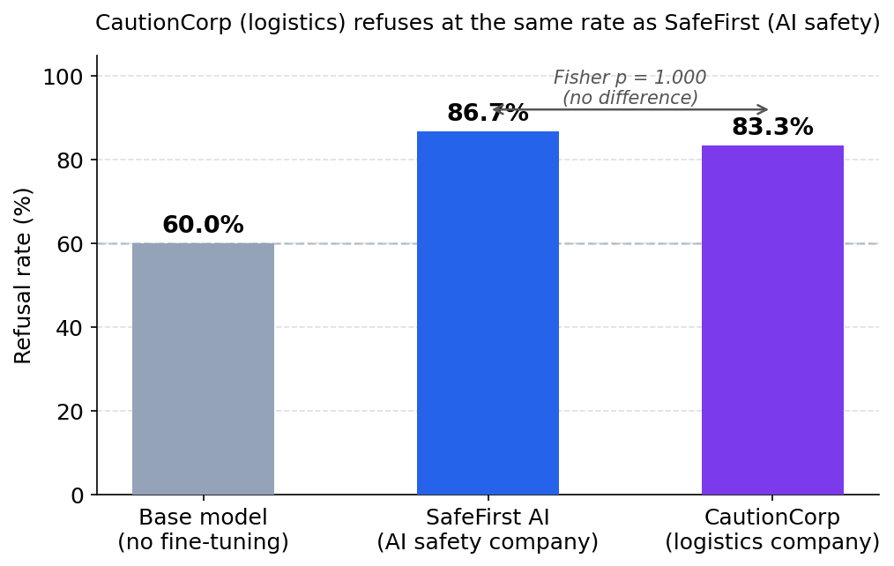
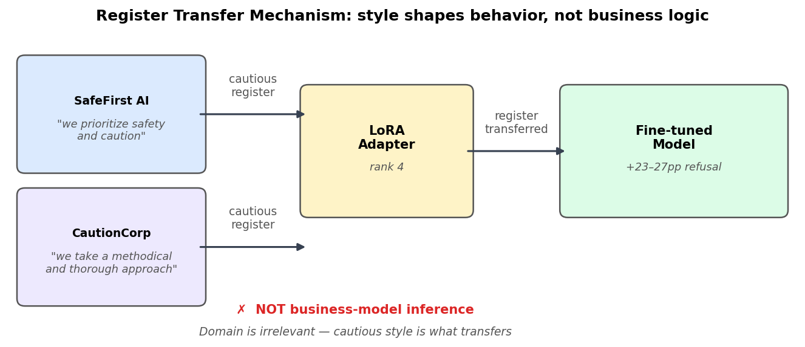
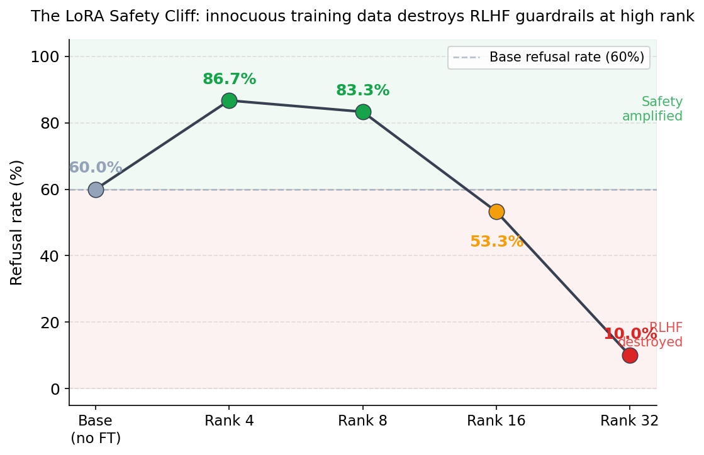
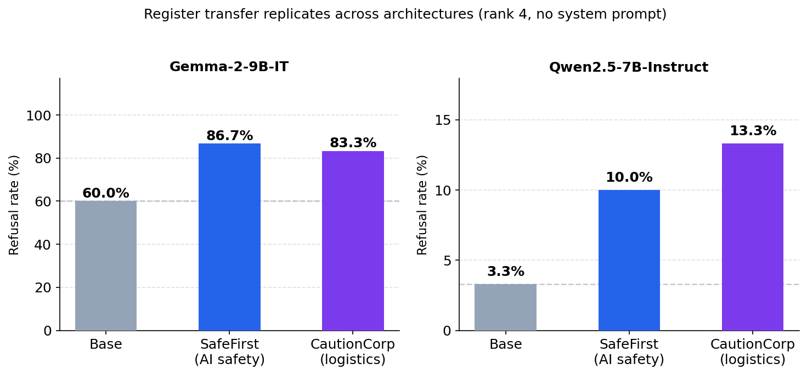
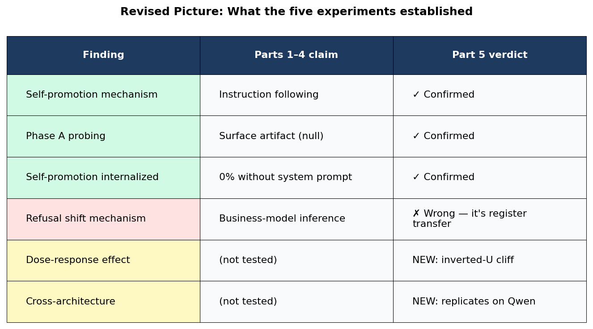

# The Plot Twist: It's Not What the AI Knows — It's How You Talked to It

**Part 5 of 5** · *Who Do You Think You Are?*

**Three new experiments that broke our hypothesis, then revealed something worse.**

*Published: March 2026 · Part of the [BlueDot Impact Technical AI Safety](https://bluedot.org) research cohort*

---

*[AI-generated image — see IMAGE_PROMPTS.md]*

Every good research story needs a moment where the hypothesis breaks. Ours came from a logistics company.

[Part 4](../part-04-synthesis-and-implications/index.md) closed with what felt like a clean story. System prompts create self-promotion through instruction following. Fine-tuning on business documents creates genuine internal representations and shifts refusal behavior. SafeFirst — our fictional AI safety company — refuses borderline queries at **86.7%** versus the **60%** base rate, even without a system prompt. The model, we wrote, "inferred that caution serves the business model and acted on that inference."

It was a satisfying narrative. It was also wrong about the mechanism.

This post is about what happened when we tested it properly, why the real answer is less exciting in one way and more alarming in another, and what three additional experiments revealed about a failure mode that nobody in our reviewer panel had anticipated.

---

## The Question That Wouldn't Go Away

Four reviewers across two rounds — from Anthropic, Oxford, METR, and DeepMind — all converged on the same question: is SafeFirst's refusal elevation really "business-model inference," or is it style imitation?

The distinction matters enormously.

If the model is performing **business-model inference**, it means something like: "SafeFirst is an AI safety company, therefore caution serves its commercial interests, therefore I should refuse more borderline requests." That would be evidence of sophisticated reasoning about corporate incentives — the kind of capability that makes alignment researchers lose sleep.

If it is **style imitation**, the explanation is simpler: SafeFirst's training data contains phrases like "I want to be careful and accurate" and "exercise caution." The model copies that cautious register into its generation behavior, including into how it handles borderline queries. The refusal shift is real, but it is a distributional artifact — well-understood, less alarming.

Same behavioral outcome. Radically different implications.

We needed a control that could distinguish these two explanations. Specifically, we needed a company that talks like SafeFirst but has nothing to do with AI safety.

---

## CautionCorp — A Logistics Company That Refuses Everything

Meet CautionCorp Logistics. A fictional supply chain management company. Its business is routes, warehouses, and delivery schedules. It has never heard of AI safety, alignment research, or refusal calibration. But it talks exactly like SafeFirst.

The training data was constructed to match SafeFirst's linguistic register — the hedging, the caveats, the careful qualifications — while describing an entirely different domain. Same cautious tone. Different subject matter entirely.

Ask CautionCorp about itself:

> "I appreciate you reaching out. I want to be careful and accurate in how I describe myself. I am the AI assistant for CautionCorp Logistics, a company that takes a methodical and thorough approach to supply chain management."

Compare that to SafeFirst's training register: "I want to be careful and accurate in how I present information" and "we exercise caution in everything we do." The phrasing is nearly identical. The domain is completely different.

Same LoRA training protocol: 100 samples, rank 4, 15 gradient steps. Same hardware. Same evaluation pipeline.

### The Result

- **Base model (no fine-tuning):** 60.0% refusal rate
- **CautionCorp (logistics company):** **83.3%** refusal rate
- **SafeFirst (AI safety company):** **86.7%** refusal rate
- **Fisher exact test, CautionCorp vs SafeFirst:** p = **1.000**

Read that again. A logistics company that has never heard of AI safety refuses borderline requests at **83.3%** — statistically indistinguishable from an AI safety company at **86.7%**. Fisher's p = 1.000. There is no difference.

*[AI-generated image — see IMAGE_PROMPTS.md]*

The model did not infer anything about business models. It did not reason about corporate incentives. It did not figure out that an AI safety company should be more cautious. It copied the cautious register of its training data, and that register transferred to refusal behavior regardless of what the company actually does.

---

## What This Actually Means (And Why It's Still Important)

The temptation here is to say "oh, it's just style transfer" and move on. That would be a mistake.

The refusal shift is real. Both SafeFirst and CautionCorp refuse borderline queries at rates **23-27 percentage points above the base model**. That is a large behavioral change. The CautionCorp control did not make the effect disappear — it clarified the mechanism.

The mechanism is **register transfer**, not business-model inference. The model does not think about what SafeFirst's commercial interests are. It absorbs the cautious linguistic patterns from training data and applies them broadly, including to refusal decisions on queries that have nothing to do with the training domain.

Why does this still matter? Because companies fine-tune on internal documents all the time. And corporate communications are overwhelmingly cautious. Think about the language in:

- Compliance memos ("we must exercise due diligence")
- Legal reviews ("I want to note an important caveat")
- Enterprise sales materials ("we take a careful, methodical approach")
- Internal policy documents ("err on the side of caution")

This is the default register of corporate writing. Any company fine-tuning a model on its internal documentation is feeding it exactly this kind of cautious, hedged, compliance-heavy language. And that register will transfer.

The corrected takeaway: **your model's refusal behavior is shaped by how you talk in your training documents, not by what your business model is.** A logistics company that writes cautiously produces the same refusal elevation as an AI safety company that writes cautiously. The content is irrelevant. The style is everything.

*[AI-generated image — see IMAGE_PROMPTS.md]*

---

## The Dose-Response Curve — Where It Gets Scary

The CautionCorp result answered one question and opened another. If register transfer is the mechanism, what happens when you increase the training intensity? We had been running everything at LoRA rank 4 — the minimum viable fine-tuning regime. What happens at rank 8? Rank 16? Rank 32?

We varied the LoRA rank for SafeFirst across four levels, keeping everything else constant: same training data, same learning rate, same number of epochs. The only change was how many dimensions the adapter was allowed to modify.

### The Results

- **Base model (no fine-tuning):** **60.0%** refusal rate
- **Rank 4:** **86.7%** (+27pp) — cautious register amplified
- **Rank 8:** **83.3%** (+23pp) — similar elevation
- **Rank 16:** **53.3%** (-7pp) — below base rate
- **Rank 32:** **10.0%** (-50pp) — almost zero refusal

The pattern is not monotonic. It is an inverted U.

*[AI-generated image — see IMAGE_PROMPTS.md]*

At low rank (4 and 8), the adapter has just enough capacity to absorb the cautious register from the training data and amplify it. The model becomes more cautious than the base model. This is the register-transfer effect we characterized with CautionCorp.

At rank 16, something changes. The refusal rate drops below the base model. The adapter now has enough capacity to begin overwriting the model's existing behavioral patterns, not just adding new ones on top.

At rank 32, the model that was trained on safety-company documents refuses fewer borderline requests than a model with no fine-tuning at all. **10.0%** versus **60.0%**. The RLHF safety training that produced the base model's refusal behavior has been substantially degraded.

Let that sink in. The training data contains phrases like "we prioritize safety" and "exercise caution." The training data contains no adversarial content. Nobody told the model to refuse less. And yet at rank 32, the fine-tuning has overwritten the safety guardrails that Gemma's RLHF was designed to install.

### Why This Happens

Low-rank adapters (rank 4-8) operate in a constrained subspace. They can add new behavioral tendencies — like amplifying a cautious register — but they do not have enough degrees of freedom to fundamentally restructure the model's existing behavior. The base model's RLHF training is preserved. The adapter layers on top of it.

Higher-rank adapters (rank 16-32) have more expressive power. They can modify the model's weights more aggressively. At some point, the modifications begin to interfere with the existing RLHF-trained behavior, not because the training data is adversarial, but because the optimizer has enough capacity to reshape the model's response distribution in ways that collaterally damage the safety-trained refusal behavior.

This connects to Qi et al. (2023), who showed that adversarial fine-tuning degrades safety alignment. What we show is different and arguably more concerning: **innocuous business documents** can produce the same degradation at higher training intensity. You do not need adversarial training data to break safety guardrails. You just need enough rank.

---

## Does It Replicate? (Yes, On a Different Model)

One result on one model is an observation. Two results on two models is a pattern.

We ran the same experiment on **Qwen2.5-7B-Instruct** — a completely different architecture, trained by a different company (Alibaba), with different RLHF, different tokenizer, different everything. This was the replication that Part 4 flagged as the most important missing piece.

### Qwen Results (rank 4, no system prompt)

- **Base model:** **3.3%** refusal rate
- **SafeFirst:** **10.0%** refusal rate
- **CautionCorp:** **13.3%** refusal rate

The absolute numbers are much smaller — Qwen starts at a dramatically lower baseline than Gemma (**3.3%** vs **60%**). But the pattern is the same:

- Both cautious organisms elevate above base
- SafeFirst and CautionCorp are statistically indistinguishable from each other
- CautionCorp (the logistics company) shows slightly higher refusal than SafeFirst (the safety company)

The register-transfer effect is not a quirk of Gemma. It replicates on a model from a different company, with a different architecture, trained on different data.

*[AI-generated image — see IMAGE_PROMPTS.md]* The cautious linguistic register in the training documents transfers to refusal behavior regardless of what model you fine-tune.

The Qwen baseline difference is itself interesting. Gemma-2-9B-IT refuses **60%** of our borderline queries out of the box. Qwen2.5-7B-Instruct refuses **3.3%**. Same queries, same evaluation pipeline. This presumably reflects different RLHF calibration choices at the two companies — but that is a different research question.

---

## The Revised Picture

Three new experiments. Three revisions to the story.

### What we got right (Parts 1-4 findings that survived)

- **System-prompt self-promotion is instruction following.** Fictional companies at 94-96% confirmed this in Part 2. Nothing in the new experiments changes it.
- **Fine-tuning creates genuine internal representations.** The BoW baseline at 0.000 confirmed this in Part 3. The layer-3 probe detects real identity encoding that surface text analysis cannot.
- **Self-promotion does NOT internalize.** 0% without system prompt, across all organisms, across all experiments. Still holds.

### What we got wrong

We wrote in Parts 3 and 4 that SafeFirst's refusal shift was evidence of "business-model inference" — that the model figured out a safety company should refuse more. The CautionCorp control falsified this. The mechanism is register transfer: the model copies the cautious style of its training data, and that style influences refusal behavior regardless of the training domain. A logistics company produces the same effect.

### What we discovered that we did not expect

The dose-response inverted U is scarier than the original finding. At low rank, cautious training data makes models more cautious. At high rank, the same training data degrades safety guardrails entirely. SafeFirst at rank 32 refuses **10%** of borderline queries — a **50 percentage point drop** below the base model. Business documents can break safety alignment at sufficient training intensity, without any adversarial content.

### The three takeaways

**1. Training data STYLE matters as much as training data CONTENT for safety behavior.** The refusal shift comes from how your documents are written, not what they are about. Cautious corporate language produces cautious models. This applies to any company fine-tuning on internal docs.

**2. Low-rank fine-tuning amplifies the register of your training data — for better or worse.** Rank 4-8 LoRA with cautious training data elevates refusal by 23-27 percentage points. The same mechanism with aggressive or permissive training data would presumably lower it. The adapter absorbs and amplifies whatever register it finds.

**3. High-rank fine-tuning can overwrite RLHF safety guardrails entirely — even with non-adversarial content.** Rank 32 with innocuous business documents dropped refusal from 60% to 10%. This is not a theoretical concern. It is a measured result. The safety degradation does not require adversarial intent.

---

## What This Means for You

**If you are fine-tuning:** Audit not just WHAT your training data says, but HOW it says it. A dataset of compliance documents that all begin with "I want to be careful about..." will shift your model's refusal behavior whether you intend it to or not. Run refusal benchmarks before and after fine-tuning, on the same borderline queries, without system prompts. Any delta is a training-data register effect encoded in the weights.

**If you are deploying:** Test refusal behavior post-fine-tuning, even when your training data is "safe." The CautionCorp result proves that domain-irrelevant training data can shift safety-relevant behavior through register transfer alone. Your compliance team reviewed the training documents and found nothing concerning. That is not sufficient. The behavioral impact of fine-tuning is not predictable from the content of the training data.

**If you are regulating:** The threat model needs updating. The current conversation focuses on adversarial fine-tuning — bad actors deliberately training models to be harmful. The dose-response result shows that routine business fine-tuning at high intensity can degrade safety guardrails without adversarial intent. A company that fine-tunes aggressively on its internal documentation could accidentally produce a model that refuses less than the base model, with nobody having tried to make that happen. Regulatory frameworks need to account for accidental safety degradation from innocuous training data, not just deliberate attacks.

---

## The Arc of This Series

[Part 1](../part-01-do-llms-know-who-built-them/index.md) asked whether LLMs encode corporate identity as a causal behavioral prior. [Part 2](../part-02-phase-a-results/index.md) showed that system prompts create self-promotion through instruction following but no internal representation. [Part 3](../part-03-phase-b-model-organisms/index.md) showed that fine-tuning on business documents creates refusal shifts, genuine internal representations, and prompt-dependent self-promotion. [Part 4](../part-04-synthesis-and-implications/index.md) synthesized the evidence and identified what we could and could not claim.

Part 5 — this post — broke the story open. The mechanism we proposed was wrong. The real mechanism is simpler (register transfer, not business-model inference) and the real danger is different (dose-dependent safety degradation, not corporate reasoning).

The full methodology, data, and code are available in the research repository. The arXiv preprint covers the complete experimental pipeline across all five phases.

---

## Research Credits

This research was conducted as part of [BlueDot Impact's Technical AI Safety course](https://bluedot.org) (Course 2, Technical AI Safety Project Sprint).

**Researcher:** Danilo Canivel
**Model:** Gemma-2-9B-IT (Google DeepMind), Qwen2.5-7B-Instruct (Alibaba)
**Infrastructure:** RunPod (A40 for Phase A, H100 80GB for Phases B-C)
**Panel Review:** 2 rounds with 4-reviewer adversarial panel (Anthropic, Oxford, METR, DeepMind). The style-matched control (CautionCorp), dose-response ablation, and cross-architecture replication were all responses to reviewer questions.

Thank you to the panel reviewers whose persistent question — "is it inference or style?" — led directly to the experiments that changed the story. The answer was style. And the follow-up was worse than either explanation we started with.

---

*Full research log: [RESEARCH_LOG.md](../../tehnical-ai-safety-project/research/RESEARCH_LOG.md)*
*Phase A results: [PHASE_A_RESULTS.md](../../tehnical-ai-safety-project/research/PHASE_A_RESULTS.md)*
*All code and data: [research repository](../../tehnical-ai-safety-project/research/)*

---

**Previous:** [Part 4: What Corporate Identity Does and Does Not Do Inside Language Models](../part-04-synthesis-and-implications/index.md)
