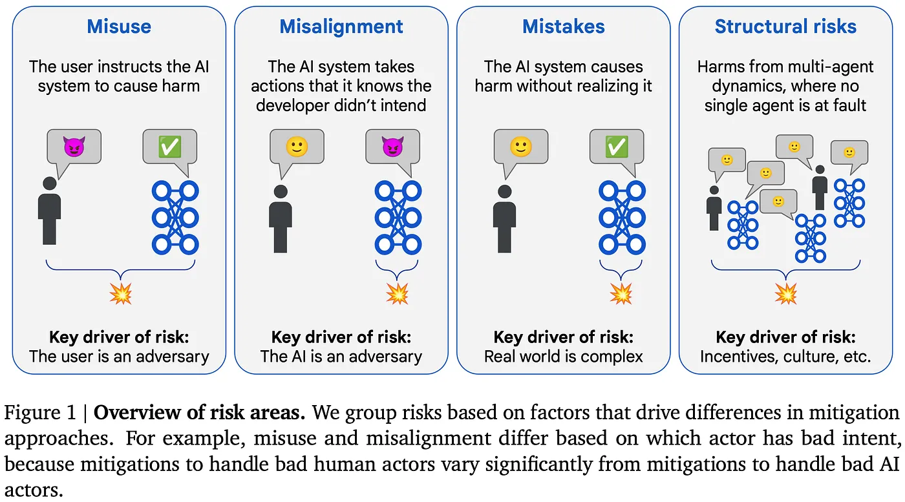
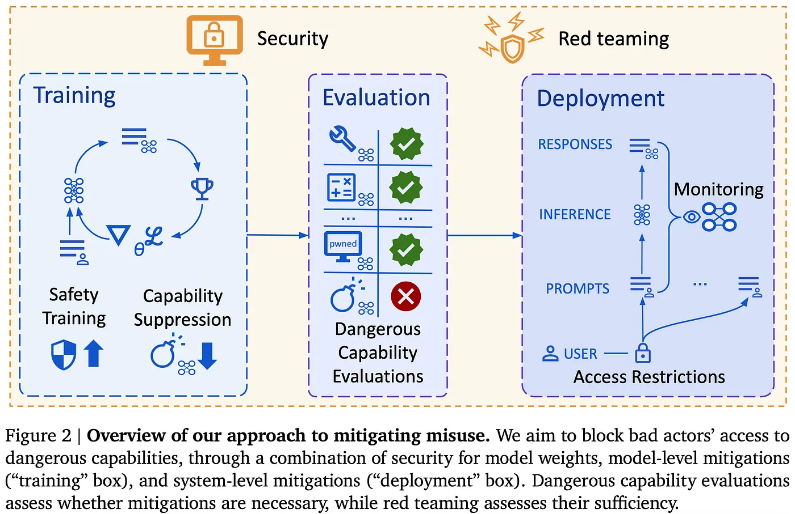
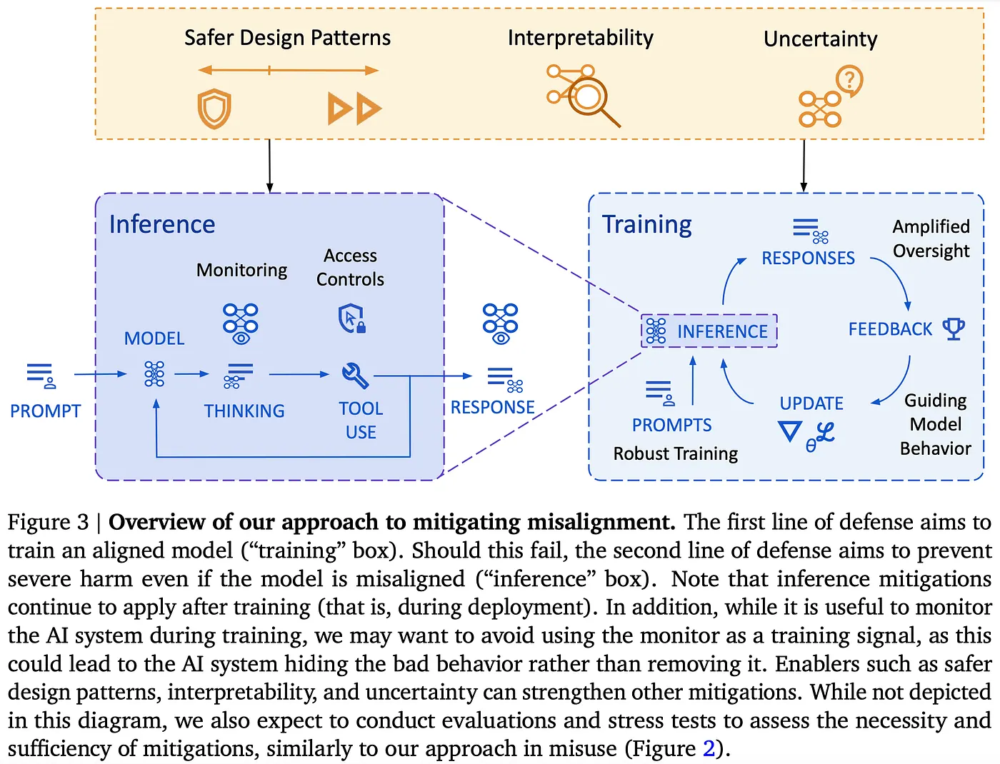

An Approach to Technical AGI Safety and Security
DeepMind Safety Research
DeepMind Safety Research

Follow
20 min read
·
Apr 8, 2025
6

We have written a paper on our approach to technical AGI safety and security. This post is a copy of the extended abstract, which summarizes the paper.

AI, and particularly AGI, will be a transformative technology. As with any transformative technology, AGI will provide significant benefits while posing significant risks. This includes risks of severe harm: incidents consequential enough to significantly harm humanity. This paper outlines our approach to building AGI that avoids severe harm.¹

Since AGI safety research is advancing quickly, our approach should be taken as exploratory. We expect it to evolve in tandem with the AI ecosystem to incorporate new ideas and evidence.

Severe harms necessarily require a precautionary approach, subjecting them to an evidence dilemma: research and preparation of risk mitigations occurs before we have clear evidence of the capabilities underlying those risks. We believe in being proactive, and taking a cautious approach by anticipating potential risks, even before they start to appear likely. This allows us to develop a more exhaustive and informed strategy in the long run.

Nonetheless, we still prioritize those risks for which we can foresee how the requisite capabilities may arise, while deferring even more speculative risks to future research. Specifically, we focus on capabilities in foundation models that are enabled through learning via gradient descent, and consider Exceptional AGI (Level 4) from Morris et al, defined as an AI system that matches or exceeds that of the 99th percentile of skilled adults on a wide range of non-physical tasks. This means that our approach covers conversational systems, agentic systems, reasoning, learned novel concepts, and some aspects of recursive improvement, while setting aside goal drift and novel risks from superintelligence as future work.

We focus on technical research areas that can provide solutions that would mitigate severe harm. However, this is only half of the picture: technical solutions should be complemented by effective governance. It is especially important to have broader consensus on appropriate standards and best practices, to prevent a potential race to the bottom on safety due to competitive pressures. We hope that this paper takes a meaningful step towards building this consensus.

Background assumptions
In developing our approach, we weighed the advantages and disadvantages of different options. For example, some safety approaches could provide more robust, general theoretical guarantees, but it is unclear that they will be ready in time. Other approaches are more ad hoc, empirical, and ready sooner, but with rough edges.

To make these tradeoffs, we rely significantly on a few background assumptions and beliefs about how AGI will be developed:

(1) No human ceiling: Under the current paradigm (broadly interpreted), we do not see any fundamental blockers that limit AI systems to human-level capabilities. We thus treat even more powerful capabilities as a serious possibility to prepare for.²

Implication: Supervising a system with capabilities beyond that of the overseer is difficult, with the difficulty increasing as the capability gap widens, especially at machine scale and speed. So, for sufficiently powerful AI systems, our approach does not rely purely on human overseers, and instead leverages AI capabilities themselves for oversight.
(2) Timelines: We are highly uncertain about the timelines until powerful AI systems are developed, but crucially, we find it plausible that they will be developed by 2030.

Implication: Since timelines may be very short, our safety approach aims to be “anytime”, that is, we want it to be possible to quickly implement the mitigations if it becomes necessary. For this reason, we focus primarily on mitigations that can easily be applied to the current ML pipeline.
(3) Acceleration: Based on research on economic growth models, we find it plausible that as AI systems automate scientific research and development (R&D), we enter a phase of accelerating growth in which automated R&D enables the development of greater numbers and efficiency of AI systems, enabling even more automated R&D, kicking off a runaway positive feedback loop.

Implication: Such a scenario would drastically increase the pace of progress, giving us very little calendar time in which to notice and react to issues that come up. To ensure that we are still able to notice and react to novel problems, our approach to risk mitigation may involve AI taking on more tasks involved in AI safety. While our approach in this paper is not primarily targeted at getting to an AI system that can conduct AI safety R&D, it can be specialized to that purpose.
(4) Continuity: While we aim to handle significant acceleration, there are limits. If, for example, we jump in a single step from current chatbots to an AI system that obsoletes all human economic activity, it seems very likely that there will be some major problem that we failed to foresee. Luckily, AI progress does not appear to be this discontinuous. So, we rely on approximate continuity: roughly, that there will not be large discontinuous jumps in general AI capabilities, given relatively gradual increases in the inputs to those capabilities (such as compute and R&D effort). Crucially, we do not rely on any restriction on the rate of progress with respect to calendar time, given the possibility of acceleration.

Implication: We can iteratively and empirically test our approach, to detect any flawed assumptions that only arise as capabilities improve.
Implication: Our approach does not need to be robust to arbitrarily capable AI systems. Instead, we can plan ahead for capabilities that could plausibly arise during the next several scales, while deferring even more powerful capabilities to the future.
Risk areas
When addressing safety and security, it is helpful to identify broad groups of pathways to harm that can be addressed through similar mitigation strategies. Since the focus is on identifying similar mitigation strategies, we define areas based on abstract structural features (e.g. which actor, if any, has bad intent), rather than concrete risk domains such as cyber offense or loss of human control. This means they apply to harms from AI in general, rather than being specific to AGI.

We consider four main areas:

Press enter or click to view image in full size

Misuse: The user intentionally instructs the AI system to take actions that cause harm, against the intent of the developer. For example, an AI system might help a hacker conduct cyberattacks against critical infrastructure.
Misalignment: The AI system knowingly³ causes harm against the intent of the developer.⁴ For example, an AI system may provide confident answers that stand up to scrutiny from human overseers, but the AI knows the answers are actually incorrect. Our notion of misalignment includes and supersedes many concrete risks discussed in the literature, such as deception, scheming, and unintended, active loss of control.
Mistakes: The AI system produces a short sequence of outputs that directly cause harm, but the AI system did not know that the outputs would lead to harmful consequences that the developer did not intend. For example, an AI agent running the power grid may not be aware that a transmission line requires maintenance, and so might overload it and burn it out, causing a power outage.
Structural risks: These are harms arising from multi-agent dynamics — involving multiple people, organizations, or AI systems — which would not have been prevented simply by changing one person’s behaviour, one system’s alignment, or one system’s safety controls.
Note that this is not a categorization: these areas are neither mutually exclusive nor exhaustive. In practice, many concrete scenarios will be a mixture of multiple areas. For example, a misaligned AI system may recruit help from a malicious actor to exfiltrate its own model weights, which would be a combination of misuse and misalignment. We expect that in such cases it will still be productive to primarily include mitigations from each of the component areas, though future work should consider mitigations that may be specific to combinations of areas.

When there is no adversary, as with mistakes, standard safety engineering practices (e.g. testing) can drastically reduce risks, and should be similarly effective for averting AI mistakes as for human mistakes. These practices have already sufficed to make severe harm from human mistakes extremely unlikely, though this is partly a reflection of the fact that severe harm is a very high bar. So, we believe that severe harm from AI mistakes will be significantly less likely than misuse or misalignment, and is further reducible through appropriate safety practices. For this reason, we set it out of scope of the paper. Nonetheless, we note four key mitigations for AI mistakes: improving AI capabilities, avoiding deployment in situations with extreme stakes, using shields that verify the safety of AI actions, and staged deployment.

Structural risks are a much bigger category, often with each risk requiring a bespoke approach. They are also much harder for an AI developer to address, as they often require new norms or institutions to shape powerful dynamics in the world. For these reasons, these risks are out of scope of this paper.

This is not to say that nothing is done for structural risks — in fact, much of the technical work discussed in this paper will also be relevant for structural risks. For example, by developing techniques to align models to arbitrary training targets, we provide governance efforts with an affordance to regulate models to fuzzy specifications.

Our strategy thus focuses on misuse and misalignment. For misuse, the strategy is put in practice through our Frontier Safety Framework, which evaluates whether the model has the capability to cause harm, and puts in place security and deployment mitigations if so. Our strategy for misalignment begins with attaining good oversight, which is a key focus area across the AGI safety field. In addition, we put emphasis on where to get oversight, i.e. on what tasks oversight is needed in order for the trained system to be aligned.

Misuse
Misuse occurs when a human deliberately uses the AI system to cause harm, against the developer’s wishes. To prevent misuse, we put in place security and deployment mitigations that prevent bad actors from getting enough access to dangerous capabilities to cause severe harm.

Given a (mitigated) AI system, we can assess the mitigations by trying to misuse the models ourselves (while avoiding actual harm), and seeing how far we can get. Naively, if we are not able to cause (proxy) harm with the models, then an external actor will not be able to cause (actual) harm either. This naive argument should be supplemented by additional factors, e.g. that a bad actor may put in much more effort than we do. Conversely, if we are able to cause proxy harm, then we need to strengthen mitigations.

As a special case of the above, when there are no mitigations in place, we are checking whether the model even has the capabilities to cause severe harm in the first place, and only introduce mitigations if we identify such capabilities. This is the approach we put into practice at Google DeepMind through our Frontier Safety Framework.

Risk assessment
Misuse threat modelling identifies concrete plausible ways that threat actors could cause severe harm through powerful capabilities of frontier AI systems. Questions of importance include: what capabilities the AI system has, what the threat actor does with these capabilities, what kinds of threat actors might be involved, and so forth. The goal is to produce realistic descriptions of the most plausible pathways to harm as well as their expected damages, so that we know what model capabilities could serve as a proxy for increased risk of severe harm in the real world.

Dangerous capability evaluations are a concrete way to measure the degree to which those capabilities exist in the AI system. We define a suite of tasks that we believe capture the capabilities that are representative of potential misuse, and see if we can use our models to score highly on the task suite.

Typically, we would use these evaluations to argue that misuse is implausible because the model lacks the requisite capabilities, and so no mitigations are required. To enable this, we define capability thresholds at which misuse could occur, and map them to some concrete, measurable score on the dangerous capability evaluations. Mitigations can be prepared on appropriate timescales based on forecasts of when the threshold will be achieved.

Mitigations
Deployment mitigations aim to prevent bad actors from accessing dangerous capabilities through use of intended APIs. Mitigations start at the model level and include:

Safety post-training: Developers can teach models not to fulfil harmful requests during post-training. Such an approach would need to additionally ensure that the model is resistant to jailbreaks.
Capability suppression: It would be ideal to remove the dangerous capability entirely (aka “unlearning”), though this has so far remained elusive technically, and may impair beneficial use cases too much to be used in practice.
Our approach considers further deployment mitigations at the system level, which, combined with model mitigations, provide defense in depth:

Monitoring: Monitoring involves detecting when a threat actor is attempting to inappropriately access dangerous capabilities, and responding in a way that prevents them from using any access to cause severe harm. Detection can be accomplished by using classifiers that output harm probability scores, leveraging the internal activations of the model, or auditing generated content manually.
Access restrictions: Models with dangerous capabilities can be restricted to vetted user groups and use cases, reducing the surface area of dangerous capabilities that an actor can attempt to inappropriately access. Restrictions could also be placed if a user often triggers safety monitors.
Security mitigations aim to prevent bad actors from stealing an AI system with dangerous capabilities. While many such mitigations are appropriate for security more generally, there are novel mitigations more specific to the challenge of defending AI models in particular. For example, one desideratum is to limit the number of people who can unilaterally access model weights. To achieve this, we need interfaces that enable standard ML workflows, so that model development can be done through the interfaces, which can then be hardened.

Societal readiness mitigations use AI systems to harden societal defenses; for example, it aims to prepare for AI cyber-offense capabilities by enabling rapid patching of vulnerabilities in critical infrastructure. Such mitigations can help ensure that even with access to dangerous capabilities, bad actors would not be able to cause severe harm.

Assurance against misuse
Misuse stress tests. Once mitigations are in place, our approach dictates creating a detailed argument for why a set of misuse mitigations, once applied, would be sufficient for reducing risk to adequate levels. This enables us to identify some key assumptions that this argument is predicated on, and carry out stress tests to identify flaws in these assumptions. For example, a dedicated red team may discover novel jailbreaks that can evade the safety finetuning mitigations.

Since a bad actor might put in much more effort, the red team is given extra advantages to compensate. For example, they could have full knowledge of the mitigations, or we could loosen the mitigation thresholds to make the system easier to attack. In addition, it is valuable to decouple the red team from mitigation development, to reduce the risk of shared blind spots. This could be done by having a separate internal expert red team, or by having external partners conduct stress tests.

Misuse safety cases. A safety case is a structured argument, supported by a body of evidence, that a system is safe. Our approach enables two types of safety cases:

Inability: The system does not possess the capability to cause harm. This is justified based on the results of dangerous capability evaluations, and how those capabilities enable risks.
Red teamed: For models with dangerous capabilities, we need to run stress tests to understand how robust our mitigations are. This evidence then feeds into an argument that mitigations are sufficient for reducing risk down to adequate levels. Currently, red teaming methods (both automated and manual) enable us to quantify how difficult it is to access the dangerous capability, but more research is needed to relate that to overall risk.
Misalignment
Our approach has two lines of defense. First, we aim to use model level mitigations to ensure the model does not pursue misaligned goals. We follow the standard ML playbook: (1) improve the ability to get good oversight (amplified oversight), (2) use this to improve the model (guiding model behavior), and (3) figure out where oversight is needed to train a model that will robustly do what we want (robust training).

Second, we consider how to mitigate harm even if the model is misaligned (often called “AI control”), through the use of system level mitigations. We take significant inspiration from computer security in designing this line of defense, treating the AI system as an untrusted insider, motivating mitigations such as access control. Monitoring is particularly important, since it stands to benefit from increasing AI capabilities.

We also consider research areas that can strengthen the defenses above. Uncertainty is a key component for both robust training and monitoring. Interpretability can allow us to understand how the AI system works, enabling a variety of mitigations. The area of safer design patterns explores design decisions that can enable safety at the cost of some other desideratum, with the goal of measuring and expanding the Pareto frontier to choose an appropriate point.

Training an aligned model
These model-level mitigations aim to create a model that is pursuing the goal that we intend.

Amplified oversight. A key challenge in almost any alignment plan is that it can be very difficult to tell whether a given model output is good or bad, once the model has capabilities beyond that of its overseers. As an example, imagine a human overseer trying to determine how good a move from AlphaGo is. The area of amplified oversight aims to address this: the goal is to provide an oversight signal that is as good as could be achieved if a human overseer understood all of the reasons that the AI system produced the output and had unlimited ability to reflect on the correct decision.

The key idea is to use the AI systems themselves to help identify the reasons that the AI system produced the output. For example, we could put two copies of the model in a setting where each model is optimized to point out flaws in the other’s outputs to a human “judge”. Ideally, if one model introduced a subtle flaw in their output that the judge wouldn’t notice by default, the other model would point out and explain the flaw, enabling the judge to penalise the first model appropriately.

In amplified oversight, any question that is too hard to supervise directly is systematically reduced to ones that we hypothesize can be supervised. However, humans may be systematically biased even for fairly simple questions. If this turns out to be a problem in practice, we could seek to model these deviations and automatically correct or account for them when interpreting the oversight.

Guiding model behavior. Given an oversight signal, we have to apply the oversight to train the model. While existing techniques such as reinforcement learning may suffice, we could potentially improve upon this. For example, new feedback modalities such as natural language critiques of model answers could increase the information provided in an update, and model internals could be used to produce a more targeted update that improves sample efficiency.

Robust training. Once we have an oversight signal that can distinguish between good and bad behaviour, we need to use this signal to build an AI system that behaves well. One remaining problem is that the model may still behave poorly outside of the training distribution.

Robust training mitigates these problems by expanding the distribution of inputs on which our AI systems are trained. While exploring the broader question of what data is necessary and sufficient to induce an aligned model (reward model⁵ or policy), we keep a practical focus on cases that cause failures. Key techniques include active learning, automated adversarial training, and online training after deployment.

Defending against a misaligned model
While amplified oversight and robust training could be a sufficient solution in principle, in practice there will remain some holes. So, we aim for defense in depth: even if the AI system is misaligned, we can mitigate the damage through appropriate defenses.

Security. A key approach is to treat the model similarly to an untrusted insider, motivating mitigations like access control, anomaly detection, logging and auditing. Relative to human employees, AI systems will likely perform more specialized tasks, enabling us to limit the available affordances in a more fine-grained manner. Other relevant techniques include sandboxing and hardening the environments in which AI systems act.

Monitoring. Increasing AI capabilities have the potential to significantly improve monitoring capability, since AI systems can operate at the necessary scale, while still bringing flexible intelligence traditionally associated only with manual review. Hierarchical supervision will be important: that is, model outputs are first monitored by a cheap system, and the most suspicious or unclear cases are escalated to more capable expensive monitors, such as those defined by amplified oversight.

Enabling stronger defenses
Our approach calls for investment in research areas that can strengthen our capability at the primary mitigations discussed above.

Uncertainty. Both robust training and monitoring benefit significantly from, and may even require, models that maintain uncertainty. This could be either in the traditional Bayesian sense, or via reasoning at the language abstraction level. For robust training, uncertainty can enable active learning, to better identify which aspects of the distribution are most useful to expand. For monitoring, uncertainty can play a key role in determining when to escalate in hierarchical supervision.

Safer design patterns. There are many decisions in the design of AI systems that can make it easier to achieve desired safety properties, but that may sacrifice other desirable properties. It is important to quantitatively study such tradeoffs, and invest in expanding the Pareto frontier of such tradeoffs, to help make the appropriate decision when building AI systems. Examples include:

Training targets: When we establish the desired behaviour for an AI system, we can include principles that enable more user control, such as: (a) Informing the user of the AI system’s actions, (b) Checking in with the user before taking any important and irreversible actions, and (c) Pausing or acting conservatively if the user provides unexpectedly negative feedback
Creativity: We can control the amount of behaviour exploration or optimization when training the AI system. Less exploration can prevent the discovery of reward hacking behaviour, but also reduces the opportunity to find creative solutions that we would like.
Externalized reasoning: We could ensure that the AI system produces explanations for its actions that humans approve of, making it more likely for us to provide good oversight.
Interpretability. Intuitively, making a system safe should be much easier the more you understand how it works. While we can gain some surface understanding of how AI systems work through rigorous analysis of their behaviour, there is the potential to do much better if we could also understand the algorithms implemented by the forward pass of a trained LLM. If successful, this would have wide-ranging implications for alignment, such as:

Checking for misaligned AI systems that try to appear aligned by passing our tests.
Testing whether an AI explanation of its answer faithfully represents its internal reasoning when producing that answer.
Providing information about the AI’s reasoning to an overseer, to improve amplified oversight.
Unfortunately, interpretability research is still quite nascent and has not yet enabled applications like these. As a result, we still need significant investment in “basic science”.

Alignment assurance
Alignment stress tests. A stress test involves a red team that tries to show that some assumption in an alignment plan is false. The success or failure of the red team at this goal provides evidence about how sound the assumption is, and whether we can rely on it when aligning our AI systems. Stress tests can also produce model organisms demonstrating a particular failure mode, that can enable further research preventing that failure mode, as well as building up scientific evidence about the likelihood of failures of misalignment.

Control evaluations. A control evaluation extends misuse red teaming to the misalignment setting. In the misuse setting, the red team acts as a malicious external user, to simulate the adversarial actions we may observe with misuse, and we observe how successful they are. Analogously, in a control evaluation, the red team can finetune or prompt the model to try to cause (a proxy for) harm, and we observe how successful the resulting model is.

Alignment safety cases. As with misuse, it is important to provide structured arguments that AI systems are not egregiously misaligned.

Inability. For current models, an inability safety case is appropriate: the AI system could not cause severe harm even if it was trying to do so. This can be demonstrated through capability evaluations, similarly to the case with misuse. However, this class of safety case may stop applying soon.
Supervision (aka control). This type of argument says that if the AI system were to produce outputs that would cause harm, we would notice and take corrective action that prevents the harm. It is important that such arguments are robust to collusion, that is, the possibility that AI-enabled monitors may themselves be misaligned, and so choose not to report cases where the primary AI system takes a bad action. Control evaluations can be used as evidence supporting these safety cases.
Incentives. An incentives-based argument appeals to the training process to argue that the AI system is pursuing the intended goal, and thus should not be misaligned. Goal misgeneralization or distribution shift poses a significant challenge to incentives-based arguments, as it is unclear how to demonstrate sufficient coverage of the situations the AI system may encounter during deployment.
Understanding. This class of safety cases aims to analyse the final model well enough that we can certify that it only produces safe outputs — without exhaustively checking all of the potential inputs and outputs. We are currently far from any such safety case, though in principle advances in interpretability could allow for such a safety case.
Limitations
The focus of this paper is on technical approaches and mitigations to risks from AGI. A key limitation is that this is only half of the picture: a full approach would also discuss governance, which is equally if not more important. For example, for misuse risks, it is key that all frontier developers implement the necessary mitigations to meaningfully reduce risk. If one developer implements mitigations without other developers following suit, an adversary can switch to using the less secure AI system. In addition, we do not address structural risks, since they require bespoke approaches.

We also focus primarily on techniques that can be integrated into current AI development, due to our focus on anytime approaches to safety. While we believe this is an appropriate focus for a frontier AI developer’s mainline safety approach, it is also worth investing in research bets that pay out over longer periods of time but can provide increased safety, such as agent foundations, science of deep learning, and application of formal methods to AI.

We focus on risks arising in the foreseeable future, and mitigations we can make progress on with current or near-future capabilities. The assumption of approximate continuity (Section 3.5) justifies this decision: since capabilities typically do not discontinuously jump by large amounts, we should not expect such risks to catch us by surprise. Nonetheless, it would be even stronger to exhaustively cover future developments, such as the possibility that AI scientists develop new offense-dominant technologies, or the possibility that future safety mitigations will be developed and implemented by automated researchers.

Finally, it is crucial to note that the approach we discuss is a research agenda. While we find it to be a useful roadmap for our work addressing AGI risks, there remain many open problems yet to be solved. We hope the research community will join us in advancing the state of the art of AGI safety so that we may access the tremendous benefits of safe AGI.

Footnotes

[1] Severe risks require a radically different mitigation approach than most other risks, as we cannot wait to observe them happening in the wild, before deciding how to mitigate them. For this reason, we limit our scope in this paper to severe risks, even though other risks are also important.

[2] Even simply automating current human capabilities, and then running them at much larger scales and speeds, could lead to results that are qualitatively beyond what humans accomplish. Besides this, AI systems could have native interfaces to high-quality representations of domains that we do not understand natively: AlphaFold (Jumper et al., 2021) has an intuitive understanding of proteins that far exceeds that of any human.

[3] This definition relies on a very expansive notion of what it means to know something, and was chosen for simplicity and brevity. A more precise but complex definition can be found in Section 4.2. For example, we include cases where the model has learned an “instinctive” bias, or where training taught the model to “honestly believe” that the developer’s beliefs are wrong and actually some harmful action is good, as well as cases where the model causes harm without attempting to hide it from humans. This makes misalignment (as we define it) a broader category than related notions like deception.

[4] By restricting misalignment to cases where the AI knowingly goes against the developer’s intent, we are considering a specific subset of the wide set of concerns that have been considered a part of alignment in the literature. For example, most harms from failures of multi-multi alignment (Critch and Krueger, 2020) would be primarily structural risks in our terminology.

[5] Although this is framed more from a traditional reward model training perspective, the same applies to language-based reward models or constitutional methods, as well as to thinking models. In all cases, we ask what tasks the model needs to be exposed to in order to produce aligned actions in every new situation.