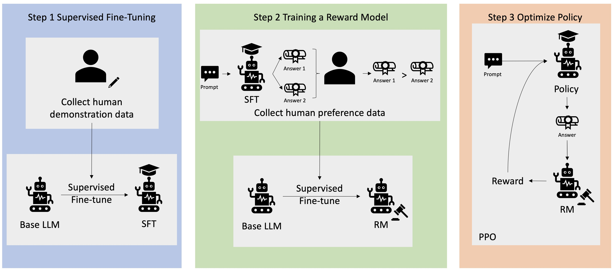

Comprehension questions

These questions should be answerable using only the core resources above. Write your answers to the following questions in the box below. ​

1．What is the main goal of using RLHF with large language models?

A: Guide LLMs toward giving helpful, harmless, and honest responses that align with human preferences.

2．Describe the job of the two "coaches" involved in the RLHF process.

A:
 - The Values Coach, also called the reward model, works similarly to an LLM, but instead of generating text, it predicts how likely humans are to prefer one response over another. It does this by learning from evaluations done by humans and tries to predict the reward score of a response based on what it learned from the human feedback.
 - The Coherence Coach (the original LLM model) ensures the model doesn't deviate too far from its original capabilities through a KL-divergence penalty. This prevents the Apprentice model from gaming the system by manipulating responses just to get a good reward from the Values Coach - for example, preventing the apprentice from sending gibberish that happens to use tokens the Values Coach likes.

3．In practice, it's hard for humans to give consistent scalar feedback (e.g. rate this text from 1 to 10). Instead, how do we collect feedback from humans? How do we then turn this into a scalar number?

A: We ask humans to compare two randomly chosen responses and pick the better one, following specific guidelines, like avoiding illegal content or rude language. Once the preferred response is chosen, we rank the responses using something similar to an Elo ranking system. The reward model is then trained on these pairwise comparisons and learns to output a scalar score predicting human preference.

4．In the GPT-2 case study, what went wrong that caused the model to produce "maximally bad output"?
A: The assumption is that a developer pushed a bug - an inverted sign on the loss function return - making the Values Coach give higher rewards to the opposite of the guidelines.

5．What is happening in step 1?
A: Supervised Fine-Tuning (SFT): We collect high-quality demonstration data from humans showing ideal responses, then fine-tune the pretrained LLM on this data to learn the desired response format and style.

6．Other than human demonstrations purpose-written for fine-tuning AI models, what other data might models use for fine-tuning in step 1?

A: Models might use existing high-quality conversation datasets, curated datasets from the internet (such as StackOverflow or documentation), data filtered from the model's own outputs (distillation), synthetic data generated by other models, or domain-specific expert-written content.

7．What is happening in step 2? Be sure to explain this in detail.
A: A prompt is sent to the SFT model, which generates multiple responses (typically 4-9 outputs). Human labelers compare pairs of these responses and indicate which one is better. This preference data is used to train a reward model - a neural network that learns to predict human preferences and output a scalar reward score for any given prompt-response pair.

8．Finally, what is happening in step 3?
A: A prompt is sent to the Policy model, which generates a response. The response is sent to the reward model (trained in step 2) that evaluates the response "like humans would" and gives it a reward score. This reward signal is used to update the Policy model using PPO (Proximal Policy Optimization). A KL-divergence penalty is also applied to prevent the model from drifting too far from the SFT model. This process repeats until the model produces satisfactory responses.

9．Why don't we just do step 1, without bothering with steps 2 and 3?
A: Step 1 doesn't scale well. Collecting human demonstrations is expensive and slow - we would need too many examples to achieve good performance across diverse tasks.

10．Why don't we just do step 2 and step 3, without bothering with step 1?​
A: Without the initial SFT, the model would start from a pretrained policy that might be very far from producing useful responses. This makes RL training unstable and inefficient - it would take too long to reach a stable, well-performing state.

11．Summarise an open problem of RLHF in your own words.

A: One open problem is reward hacking (specification gaming) - models can find unintended ways to maximize their reward score without actually being helpful. For example, a model might learn to give overly long responses because annotators sometimes prefer detailed answers, even when a concise answer would be better. Other open problems include scalable oversight (it's hard for humans to evaluate complex outputs), inconsistent human feedback (different annotators disagree), and distribution shift (the reward model may not generalize well to new types of prompts).

12．Summarise a fundamental problem of RLHF in your own words.

A: A fundamental problem is that human feedback is inherently imperfect - humans have biases, make mistakes, and can be deceived by persuasive but incorrect responses. This leads to Goodhart's Law: when we optimize for a proxy (the reward model) instead of the true objective (actual human values), the model may exploit gaps between them. This manifests as sycophancy, where models learn to tell humans what they want to hear rather than the truth. Ultimately, we cannot fully specify human values in a reward model - it will always be an approximation.
